#  Smart Fan for Kidsuno

## 1. Code

[DOWNLOAD](../Code.zip)

Download and unzip these files. Here all codes are in folder **1.Code_kidsuno**.

For convenience, we move the codes into: **D:\Code\1.Code_kidsuno**. You can also choose to move it into any disks at will. 

---

## 2. Development Environment Configuration

### 2.1 KidsBlock Download

1. [KidsBlock Download](https://wiki.kidsbits.cc/projects/KidsBlock/en/latest/download/)
2. Installation
   - [Windows System](https://wiki.kidsbits.cc/projects/KidsBlock/en/latest/Windows/)
   - [MacOS System](https://wiki.kidsbits.cc/projects/KidsBlock/en/latest/MacOS/)
3. [Driver Installation](https://wiki.kidsbits.cc/projects/KidsBlock/en/latest/driver/)

---

### 2.2 KidsBlock Tutorial

1. Make sure the board is connected to computer. Open KidsBlock and choose a device.

Choose **kidsuno**.

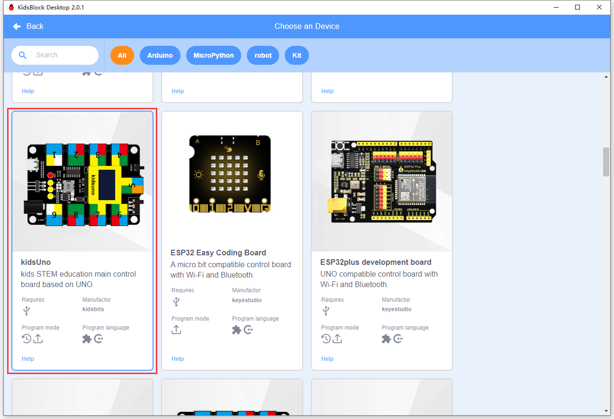

Click **Connect**.

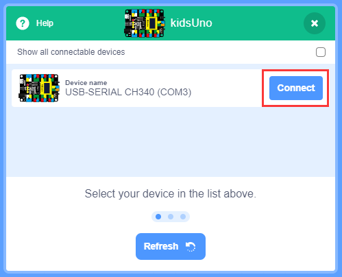

**Go to Editor**.

Click : shift realtime mode into upload mode.

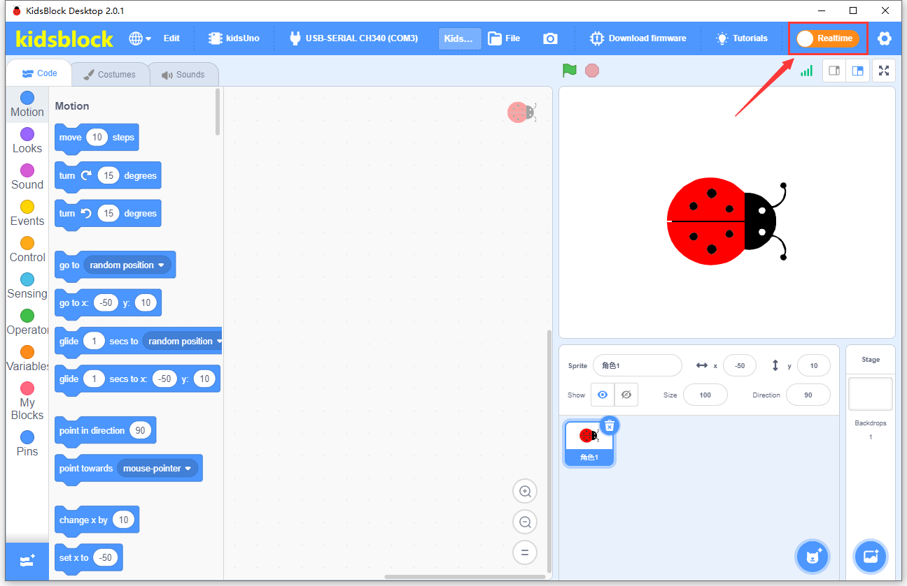

2. Build code blocks and upload.

**Method ①**: Directly drag blocks to the editing area.

After building your blocks, save it to your computer: **File --> Save to your computer**

Click  to upload the code.

**Method ②**: Load code from your computer.

Download code in **1. Code** to your computer. For convenience, here we save it to D:\Code\1.Code_kidsuno.

**File --> Load from your computer** and choose code to open.

After loading code, connect to the corresponding port.

After that, click  to upload code.

**Main Interface**

---

## 3. Modules

Please move the codes to a convenient path as your needs, for instance, path: **D:\Code\1.Code_kidsuno**.

### Kidsuno Ports View

During experiments, modules can only be connected to ports in the same color.

### 3.1 White LED Module

**LED (Light-Emitting Diode)**

LED is a commonly used light emitting device that converts electrical energy into light energy. Usually, it is used as an indicator in circuits and instruments, or as part of texts or numeric display.

It generally includes gallium(Ga), arsenic(As), phosphorus(P), nitrogen(N) and so on. 

|     LED components      | Emitting light colors |
| :---------------------: | :-------------------: |
| gallium arsenide diode  |          red          |
| gallium phosphide diode |         green         |
|  silicon carbide diode  |        yellow         |
|  gallium nitride diode  |         blue          |

#### Parameters

Operating voltage: DC 3.3 ~ 5 V

Operating current: 1.5 mA (Peak: 2.3mA)

Maximum power: 0.07 W

Control signal: digital signal

Dimensions: 24 x 48 x 18 mm (without housing)

Positioning holes: diameter of 4.8 mm

Interface: telephone socket

#### Principles

Modules with blue housing are digital ones, so we should connect to digital io pins of the mainboard (ports with blue).

In this experiment, we connect the white LED module to port 1. According to the board ports view, the digital io pin at port 1 is digital pin D5.

When we set the pin to high(1), the LED lights up in white; if we set to low(0), it will be off.

#### Wiring Diagram

#### Test Code

Open KidsBlock and connect to the board, click **File --> Load from your computer**.

Choose D:\Code\1.Code_kidsuno to open **3.1Light_on.sb3**.

Click  to connect to COM port and then .

#### Explanation

**Code Blocks**

|            Blocks             |          Code block           |
| :---------------------------: | :---------------------------: |
|    |      |
|              |  |
|              |    |
|  |  |
|  |        |

**Conceive**

1. **Initialization**

   Set pin mode.

   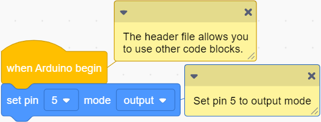

    

   **Build blocks:**

   ① Drag  and  to the editing area.

   ② Click the triangle to choose pin 5.

   

   ③ Modify the mode into output .

   Three pin mode:

   - input
   - output
   - input-pullup

   

   Q ：Why output?

   A ：The code is written for the mainboard. For the board, pin D5 is outputting power levels (high or low) to the connected module.

   

2. **Main Code**

   Loop: LED lights on for 1s and goes off for 1s, in a loop.

   

    

   **Build blocks:**

   ① Drag .This is a loop code, in which codes will run forever.

   ② Drag  into "forever".

   There are two power level to output: 

   - high
   - low
   
   Choose pin to 5 and output high.

   ③ Drag  into  "forever". This is a delay code.

   

   Q ：Why delay 1s?

   A ：If you output a high level to LED, it will be always on. Yet, we add a delay of 1s, so it lights up for only 1s. Delay time is the ON/OFF time of LED.

   

   Pin outputs high for 1s:

   

   ④ Right-click the code and choose "Duplicate".

   

   As follows:

   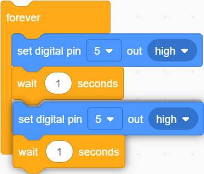

   Set the output to low. Pin 5 outputs low for 1s.

   

   LED will lights on for 1s and goes off for 1s, in a loop.

#### Test Result

After uploading code, the LED module will flash with an interval of 1s (on for 1s and off for 1s).

---

### 3.2 RGB LED Module (Common Anode)

RGB LED is imaged in the intersection of three primary colors (RGB): red, green and blue. Both white LED and RGB LED are able to emit white light. The former is presented directly in white, while the latter is mixed with red, green and blue.

**Trichromatic Theory**

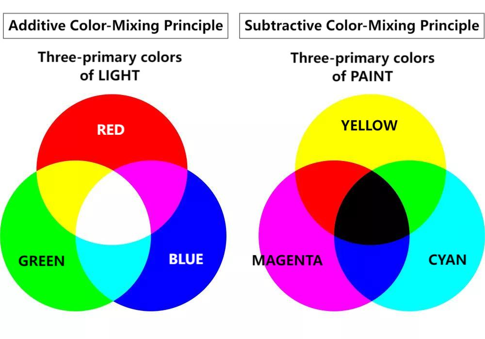

Human eyes are sensitive to RGB colors. Most colors can be synthesized by RGB in different proportions. Therefore, the vast majority of monochromatic light can also be decomposed into RGB colors. This is the most basic principle of colorimetry --- trichromatic theory.

Red, green and blue lights are called additive primary colors because by the combination of these three primaries in different proportion, various colored lights will produce. Similarly, there are also subtractive ones. So we may add or/and subtract colors as needed. 

The three primary colors of the paint can not compose white, yet, with optical elements, those of light can do it, which is mixed by **three equal parts of R, G, B**.

#### Parameters

Operating voltage: DC 3.3 ~ 5V 

Current: 19.5 mA

Maximum power: 0.975 W

Operating temperature: -10°C ~ +50°C

Dimensions: 24 x 48 x 18 mm (without housing)

Positioning holes: diameter of 4.8 mm

Interface: telephone socket

#### Principle

This RGB LED integrates 3 LED inside: red, green and blue.

This RGB LED diode is designed with 4 pins, among which three control LED pins of R, G and B, and one is common anode, which need to be connect to power positive.

When using, we need to connect this module to the white ports of the mainboard.

In this experiment, we connect the RGB LED module to white port 1. According to the board ports view, R pin is connect to D3, G to D5 and B to D6.

When we set the pins to high(1), the LED lights up in corresponding color; if we set to low(0), it will be off.

#### Wiring Diagram

#### Test Code

Open KidsBlock and connect the board to computer. Choose **File --> Load from your computer**.

Choose path D:\Code\1.Code_kidsuno and open **3.2RGB.sb3**.

Click  to connect to port and then  the code.

#### Explanations

**Code Blocks**

|            Blocks             |          Code block           |
| :---------------------------: | :---------------------------: |
|    |      |
|              |  |
|              |    |
|  |  |
|  |        |

**Conceive:**

The framework of the code is similar to the previous project, so you may have a reference. 

1. **Initialization**

   Set pin mode.

   

2. **Main code**

   Loop: LED lights up in red, green, blue and white for 1s each. 

   

#### Test Result

After uploading code, the RGB LED will circulate to light up in red, green, blue and white respectively, each color for 1s, in a circulation.

---

### 3.3 Photo Interrupter

Photo interrupter works based on photoresistor and light source. 

Generally, this module is composed of two photoelectric components: light source and the light receiver. The light source is usually an LED, while the light receiver consists of a photosensitive element and a signal amplifier. When light is blocked, the photosensitive element receives no light, so its resistance value changes. This change will be converted into an electrical signal and then processed.

#### Parameters

Operating voltage: DC 3.3 ~ 5V 

Operating current: 24 mA

Maximum power: 0.12 W

Operating temperature: -10°C ~ +50°C

Control signal: digital signal

Dimensions: 24 x 32 x 18 mm (without housing)

Positioning holes: diameter of 4.8 mm

Interface: telephone socket

#### Principle

Modules with blue housing are digital ones, so we should connect to digital io pins of the mainboard (ports with blue).

In this experiment, we connect the module to port 3. According to the board ports view, the digital pin at port 3 is D3.

When objects block lights, the module outputs high; if not, it outputs low.

#### Wiring Diagram

#### Test Code

Open KidsBlock and connect the board to computer. Choose **File --> Load from your computer**.

Choose path D:\Code\1.Code_kidsuno and open **3.3Photo_Interrupt.sb3**.

Click  to connect to port and then .

#### Explanations

**Code Blocks**

|              Blocks               |               Code block                |
| :-------------------------------: | :-------------------------------------: |
|        |                |
|                  |            |
|                  |    |
|        |    |
|        |    |
|            |  |
|            |    |
|            |          |
|  |                    |
|  |                        |
|  |                        |
|      |            |
|      |           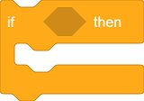           |
|      |                  |

**Conceive:**

1. **Initialization**

   Set pin mode and serial monitor first.

   

    

   **Build blocks:**

   ① Drag ,  and  to the editing area as above.

    is used to set baud rate and initialize serial monitor. If you need a serial port in an experiment, this code block will be necessary, or else the monitor may fails to print results. 

   ② Drag  to the editing area and duplicate it twice, and set them as shown above. 

   This block will define a new variable whose range(Global or Local), type and initial value can be set.

2. **Main code:**

   Loop: Cumulatively read the values of the module and print them.

   

    

   **Build blocks:**

   ① Drag , ,  to the editing area, and place them as follows:

   

   The module is connect to D3 on the board so we set to read D3 pin value and assign it to State.

   ②  is an operation that it determines whether the two values equal each other. If yes, the condition is True.

    denies the condition in it.

    is a variable.

   Drag ,  and  to the editing area and put them as follows:

   

   Place it in the condition of .

   

   It means: the value of variable State **≠** the value of variable lastState.

   ③  determines whether the condition is true. If it is, codes in it will be executed. If not, codes in it will be skipped.

   Put  in "forever".

   Combine them as follows:

   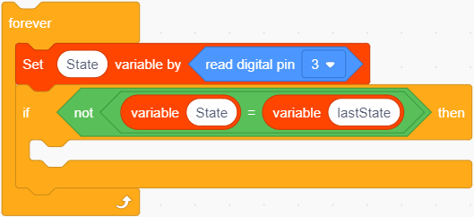

   These blocks reads the value of D3 and assigns it to variable State, and then it determines whether State ≠ lastState.

   ④ Build ,  and  as follows:

   

   Then put this combination into "if" as shown below:

   

   These blocks reads the value of D3 and assigns it to State, and then it determines whether State ≠ lastState.

   - State ≠ lastState: execute the second "if" block and determine whether State =1.
   - State = lastState: skip.
   
   ⑤  is an operation whose result is the sum of these two values.
   
   Drag  into the editing area.
   
   Set the left one to PushCounter and the right one to 1: 
   
   
   
   Put ,  and  as follows:
   
   
   
   In these blocks, a **nested-if structure** is adopted: an **if statement** in another **if**. Let's have a look at the operational logic diagram:
   
   
   
   ① Assign the value output by the photo interrupter to State
   
   ② Determine whether State ≠ lastState
   
   - State ≠ lastState: execute the next if statement
   - State = lastState: exit if loop to execute ⑤
   
   ③ (Precondition: State ≠ lastState) Determine whether State = 1

   - State = 1: PushCounter +1 and output it.
   - State ≠ 1: exit if loop.
   
   ④ (Precondition: State ≠ lastState, State = 1) PushCounter +1 and print the value on Shell.
   
   ⑤  Assign the value of State to lastState
   
   
   
   Initial Settings:
   
   | Initial state                                                |          |
   | ------------------------------------------------------------ | -------- |
   | State: the present value output by the sensor signal terminal | set to 0 |
   | lastState: the last value output by the sensor signal terminal | set to 0 |
   | PushCounter: the number of times of light being interrupted  | set to 0 |
   
   Execution:
   
   | State                                      |                                                              |
   | ------------------------------------------ | ------------------------------------------------------------ |
   | the object passes through the groove once  | the initial value of lastState is 0; State detects object so its value is 1. State ≠ lastState, State = 1 PushCounter+1, and output the value. lastState = State, lastState = 1 |
   | the object leaves from the groove          | lastState = 1; State detects no object so its value is 0. State ≠ lastState, State = 0 lastState = State, lastState = 0 |
   | the object passes through the groove again | lastState = 0; State detects object so its value is 1. State ≠ lastState, State = 1 PushCounter+1, and output the value. lastState = 1 |
   | the object leaves from the groove          | lastState = 1; State detects no object so its value is 0. State ≠ lastState, State = 0 lastState = 0 |

#### Test Result

NOTE: Before uploading code, please set baud rate first to avoid garbled words.

Click  and set Buadrate to 9600.

After uploading code, place an opaque object in in the sensor groove and then remove it, so the light will be interrupted once. The serial monitor will print the number of times of light being interrupted. 

---

### 3.4 Capacitive Touch Sensor

On the capacitive touch sensor, a touch switch is reserved to enable switch function through its variable area.

After powering on, the sensor requires about 0.5 seconds to stabilize itself. During this time, please do not touch it. Its all functions are disabled due to a self-calibration, whose cycle is about 4 seconds.

#### Parameters

Operating voltage: DC 3.3 ~ 5V 

Operating current: 3 mA

Maximum power: 0.015 W

Operating temperature: -10°C ~ +50°C

Input signal: digital signal

Dimensions: 24 x 48 x 18 mm (without housing)

Positioning holes: diameter of 4.8 mm

Interface: telephone socket

#### Principle

Modules with blue housing are digital ones, so we should connect to digital io pins of the mainboard (ports with blue).

In this experiment, we connect the module to port 4. According to the board ports view, the digital io pin at port 4 is D2.

When we touch the capacitive area on the sensor, the sensor outputs high(1) and the on-board red LED lights up; when we release, it outputs low(0) and the LED goes off.

#### Wiring Diagram

#### Test Code

Open KidsBlock and connect the board to computer. Choose **File --> Load from your computer**.

Choose path D:\Code\1.Code_kidsuno and open **3.4Touch.sb3**.

Click  to connect to port and then  the code.

#### Explanations

**Code Blocks**

|              Blocks               |              Code block               |
| :-------------------------------: | :-----------------------------------: |
|        |              |
|                  |          |
|                  |  |
|        |  |
|        |  |
|  |                      |
|      |          |
|      |            |
|      |                |

**Conceive:**

1. **Initialization**

   Set pin mode and initialize serial port.

   

2. **Main Code**

   Loop: determine whether the value of pin D2 equals 1.

   - the value = 1: the module is touched and the serial monitor prints *You pressed the button !* 
   - the value ≠ 1: the module is not touched and the serial monitor prints *You loosen the button !* 

   Finally, add a delay of 0.1s: refresh the outputs every 0.1s.

#### Test Result

NOTE: Before uploading code, please set baud rate first to avoid garbled words.

Click and set Buadrate to 9600.

After uploading code, touch the capacitive area on the sensor, and the monitor will print *You pressed the button!*. Release the touch switch, and it prints *You loosen the button!* .

---

### 3.5 TM1650 4-digit Tube Display

The module integrates 0.36-inch common cathode 4-digit tube display which is in red when lighting up. Its driver chip is TM1650, a chip for LED drive control special circuit. When using, we only need 2 signal wires to control the digital tube.

#### Parameters

Operating voltage: DC 3.3 ~ 5V 

Operating current: 42 mA

Maximum power: 0.21 W

Operating temperature: -10°C ~ +50°C

Dimensions: 24 x 48 x 18 mm (without housing)

Positioning holes: diameter of 4.8 mm

Interface: telephone socket

#### Principle

TM1650 adopts a two-wire serial transmission protocol (not the standard I2C protocol). The chip communicates with MCU to drive digital tube only by two pins, which greatly saves pins. 

During using, this module needs to be connected to the ports in green on th board.

However, first of all, we need to import the TM1650 library.

#### Wiring Diagram

#### Test Code

Open KidsBlock and connect the board to computer. Choose **File --> Load from your computer**.

Choose path D:\Code\1.Code_kidsuno and open **3.5Four-digit numeral tube.sb3**.

Click  to connect to port and then  the code.

#### Explanations

**Code Blocks**

|                    Blocks                     |                         Code block                          |
| :-------------------------------------------: | :---------------------------------------------------------: |
|                    |                                    |
|  |    |
|  |  |
|                        |                      |
|                        |                              |
|                        |                          |
|                        |                        |
|              |                                      |
|                        |                                |
|                  |                                |
|                  |                                  |
|                  |                                      |

**Conceive**

1. **Initialization**

   Initialize the digit tube first. Define an integer variable i with an initial value of 0.

   
   
    
   
   **Build blocks:**
   
   ① Click  and choose Display, find and click **Four Digital Tube TM1650_IIC** to add this module.
   
   
   
   Click Back.
   
   
   
   This module is successfully added.
   
   
   
   ② .
   
   ③ Add  under the "begin" block.
   
   
   
   This block initializes the TM1650 four-digit tube module. Three modes are optional: clear, ON, OFF.
   
   
   
   ④ Duplicate .
   
   
   
   As follows: 
   
   
   
   Modify its mode to ON to turn on this module.
   
   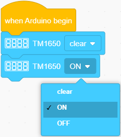
   
   ⑤ Put  below and name the variable to i.

2. **Main Code**

   Loop: display 0 ~ 999 in order, refresh the display every 0.01s.

   

    

   **Build blocks:**

   ① 

   ② Place  in the "forever".

   ③ Find , and put   into the left of  and name the variable to i; set the value on the right to 999.

   

   These blocks mean variable i < 999. Put them in "if else" to set as a condition.

   

   ④ Put  under if. This block sets the module to display messages and number strings. By default, the message is abcd.

   For this module, the displayed content must be in string form, so we cannot directly put the variable block into it. We need convert the variable to a string so that it can be shown on the tube.

   

   Drag  into the "display" block and set the output type. Three types are optional: integer, decimal, string.

   

   Duplicate the variable i and put it into the "display" block.

   

   

   As follows:

   

   Modify the type into string.

   

   These blocks will convert the variable i to string form, and display on the 4-digit tube.

   ⑤ Add  in if and name the variable to i. This block enables a variable to automatically increase or decrease.

   ++: automatically increase 1

   --: automatically decrease 1

   
   
   We have learned a similar code in chapter 3.3, which also make the variable to increase 1: 
   
   
   
   ⑥ Put  under else and modify the variable name to i. It sets i to 0.
   
   
   
   **Examples:**
   
   In initialization, we set the initial value of i to 0.
   
   In first loop, i = 0, so i < 999, the value 0 will be converted into a string 0 to display on the tube. Next,  i++ executes so i = 1.
   
   In second loop, i = 1, so i < 999, the value 1 will be converted into a string 1 to display on the tube. Next,  i++ executes so i = 2.
   
   ... ...
   
   In the thousandth loop, i = 999, at this time i is not lower than 999, so i is set to 0.
   
   In the loop of number thousand and one, i = 0, the value 0 will be converted into a string 0 to display on the tube. Next,  i++ executes so i = 1.
   
   ... ...
   
   So then the displayed number will circulate within 0 ~ 999
   
   ⑦ Add a delay  and set to 0.01s.
   
   Therefore, numbers on the tube will be refreshed every 0.01s.
   
   
   

#### Test Result

After uploading code, the module displays number from 0 to 999, and the results refreshes every 0.01s.

---

###  3.6 DS18B20 Temperature Sensor

The DS18B20 sensor is a digital module used to detect temperature. It outputs digital signal and features small size, strong anti-interference ability and high precision.

#### Parameters

Operating voltage: DC 3.3 ~ 5V 

Current: 0.15 mA

Maximum power: 0.00075 W

Temperature detection range: -55°C ~ +125°C (accuracy of ±0.4°C within -10°C ~ +70°C)

Operating temperature: -10°C ~ +50°C

Dimensions: 24 x 32 x 18 mm (without housing)

Positioning holes: diameter of 4.8 mm

Interface: telephone socket

#### Principle

Modules with blue housing are digital ones, so we should connect to digital io pins of the mainboard (ports with blue).

In this experiment, we connect the module to port 6. According to the board ports view, the digital io pin at port 6 is D4.

#### Wiring Diagram

#### Test Code

Open KidsBlock and connect the board to computer. Choose **File --> Load from your computer**.

Choose path D:\Code\1.Code_kidsuno and open **3.6Temperature.sb3**.

Click to connect to port and then  the code.

#### Explanations

**Code Blocks**

|            Blocks             |              Code block               |
| :---------------------------: | :-----------------------------------: |
|    |              |
|    |  |
|    |  |
|        |  |
|  |          |

**Build blocks:**

Click  to add library **18b20**.

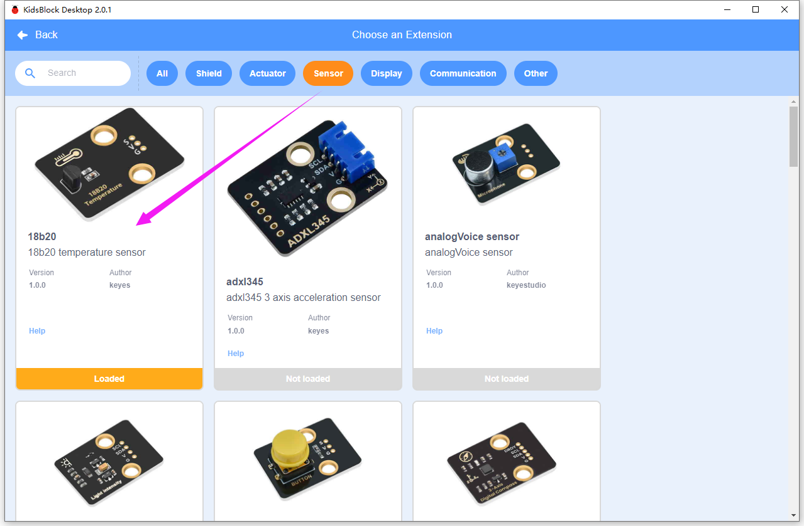

1. **Initialization**

   Initialize the serial port.

   

2. **Main Code**

   Loop: Read the temperature value detected by DS18B20 sensor and print it without wrapping.

   

    

   **Build blocks:**

   ① Drag ,  and  to the editing area and place them as the following: 

   

   These blocks will print the the temperature value detected by pin D4 (DS18B20 temperature sensor) on the serial monitor without wrapping. The value is in the unit of °C, or you can change it to F in the code.

   

   Q ：Why outputting the temperature value without wrapping?

   No wrap: these results will be output in the same line.

   Wrap: these results will be output in the next line.

   If we set to wrap to output, the unit °C and the temperature value cannot be displayed on the same line.

   Wrap:

   

   No wrap:

   

   A ：We set to output without wrapping to make the value and °C in the same line.

   

   ② Add  in "forever" and set the print message to "  °C". There are two spaces before °C.

   

   
   
   Q ：Why two spaces? 
   
   If here is no space, the unit °C will be very close to the value.
   
   No space:
   
   
   
   With spaces:
   
   
   
   A ：For convenient to check results, we add two spaces before °C.
   
   

#### Test Result

NOTE: Before uploading code, please set baud rate first to avoid garbled words.

Click to set Buadrate to 9600.

After uploading code, the serial monitor prints the temperature value detected by DS18B20 sensor.

---

### 3.7 Ultrasonic Sensor

When bats fly, they produce ultrasonic waves from their throats, which are emitted from their mouths. When ultrasonic waves encounter an insect or obstacle, they are reflected back and then picked up by the bats' ears. Bats calculate the distance by the reflected wave and also determine whether the target is an insect or an obstacle. 

Therefore, scientists developed ultrasonic ranging. The ultrasonic sensors in this experiment are based on bionic science.

#### Parameters

Operating voltage: DC 5V 

Operating current: 15 mA 

Operating frequency: 40 KHz

Measuring angle: ≤ 15°C

Ultrasonic range: 2 cm ~ 400cm (peak)

Operating temperature: -10°C ~ +50°C

Output signal: analog signal

Dimensions of ultrasonic sensor: 20 x 45 x 12 mm (without pins)

Dimensions of ultrasonic sensor converter: 24 x 32 x 18 mm (without housing)

Positioning holes: diameter of 4.8 mm

Interface: telephone socket

#### Principle

After the ultrasonic sensor receives the trigger signal (the board sends a high level to the Trig pin), the module automatically sends eight 40KHZ square waves and starts timing. 

The ultrasonic wave propagates in the air and immediately reflects back when it encounters the obstacle surface on the way (the Echo pin sends a high level to the board). 

The ultrasonic receiver stops timing as soon as it receives the reflected waves. So then the module will record the interval between the initial transmission of the ultrasonic wave and the reception of the echo.

This is how the sensor calculate the distance from the obstacle.

**Working Principle:**

1. Trig pin enables the distance detection and transmits a high level signal for at least 10us.

2. Circularly send eight 40KHz square waves, and automatically detect whether there is a response signal.

3. If there is a response, Echo pin will output high lasting from ultrasonic wave transmitting to receiving.

	Calculation of the distance between the ultrasonic sensor and the obstacle:

	Distance = high level duration × 340m/s ÷ 2

	(The sound speed varies from the nature and state of the medium. In air, the sound speed is about 340m/s at 1 standard atmosphere and 15 °C)

Since the ultrasonic module pins cannot be directly connected to the board, a converter module is required to connect it to the port in yellow on the board.

In this experiment, we connect the module to port 7. According to the board ports view, Trig pin is connected to D8 and Echo is to A0.

#### Wiring Diagram

#### Test Code

Open KidsBlock and connect the board to computer. Choose **File --> Load from your computer**.

Choose path D:\Code\1.Code_kidsuno and open **3.7Ultrasonic.sb3**.

Click  to connect to port and then .

#### Explanations

**Code Blocks**

|            Blocks             |              Code block               |
| :---------------------------: | :-----------------------------------: |
|    |              |
|    |  |
|    |  |
|              |    |
|  |          |
|  |                |

**Build blocks:**

Click  to add library **Ultrasonic**.

1. **Initialization**

   Initialize the serial port.

   

2. **Main Code**

   Loop: print the distance value detected by the ultrasonic sensor, and refresh the results every 0.1s.

   

#### Test Result

After uploading code, the serial monitor prints the distance value between the ultrasonic sensor and the obstacle.

---

### 3.8 Five-channel AD Button Module

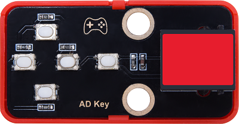

When using, the five-channel AD button module only occupies one analog port, which greatly saves ports and pins. In analog acquisition, when we press different buttons, it outputs different voltages.

#### Parameters

Operating voltage: DC 3.3 ~ 5V 

Operating current: 2.5 mA

Operating power: 0.0125 W

Operating temperature: -10°C ~ +50°C

Output signal: analog signal

Dimensions: 24 x 48 x 18 mm (without housing)

Positioning holes: diameter of 4.8 mm

Interface: telephone socket

#### Principle

Due to the circuit design, the corresponding output voltage varies when we press different button. 

The voltage value is read by the board ADC and then compared with the pre-determined voltage range of each button, so that we can determine which button is pressed.

**What is ADC?**

ADC(Analog to Digital Converter) converts analog values to digital ones. The ADC acquisition is integrated in our board, so you can call it directly. 

**Kidspico ADC Parameters**

1. Reference voltage: 5V

1. Resolution: 10bit

   A n-bit ADC means this ADC contains 2ⁿ scales. 

   10-bit ADC contains $2^{10}=1024$ scales, and it outputs totally 1024 digital values (including from 0～ 1023), each scale is $\frac{5}{1023}≈0.00489(V)$

2. General ADC input voltage calculation:

   $ Vin= \frac {AVDD_{ADC}}{2^{Resolution Bit}-1}*ReadData$ 
   
   $AVDD_{ADC}$: Reference voltage

Modules with red housing are analog ones, so we should connect to analog io pins of the mainboard (ports with red).

In this experiment, we connect the module to port 8. According to the board ports view, the analog io pin at port 8 is A7.

#### Wiring Diagram

#### Test Code

Open KidsBlock and connect the board to computer. Choose **File --> Load from your computer**.

Choose path D:\Code\1.Code_kidsuno and open **3.8Five-way AD.sb3**.

Click  to connect to port and then .

#### Explanations

**Code Blocks**

|              Blocks               |               Code block                |
| :-------------------------------: | :-------------------------------------: |
|        |                |
|                  |            |
|                  |      |
|        |    |
|        |    |
|            |  |
|            |    |
|            |          |
|  |                  |
|  |            |
|  |                    |
|      |            |
|      |                      |
|      |                  |

**Conceive**

1. **Initialization**

   Set pin mode and initialize the serial port.

   

2. **Main Code**

   Loop: Determine which button is pressed.
   
   
   
    
   
   **Build blocks:**
   
   ① Add blocks , , ,  and  to the editing area as follows:
   
   
   
   ② Add blocks , ,   and  as follows: 
   
   
   
   So far, when the ADC value read by pin A7 is less than 100, the serial monitor print “  no key  is pressed”. Note that there are two spaces in the front of the messages, so that the value will be separated from the printing contents.
   
   ③  is an "and" block. When the two conditions in it are both satisfied, it outputs True.
   
   Add blocks ,  and as follows:
   
   
   
   These conditions require the value at pin A7 is within 100 ~ 300.
   
   Add  and  as follows:
   
   
   
   When the ADC value at A7 is within 100 ~ 300, the serial monitor prints “  SW5 is pressed”. Note that there are two spaces in the front of the messages, so that the value will be separated from the printing contents.
   
   ④ Duplicate the "if" block in ③ four times.
   
   
   
   Finally add a delay .
   
   
   
   In the same way:
   
   When the ADC value at A7 is within 300 ~ 500, the serial monitor prints “  SW4 is pressed”. 
   
   When the ADC value at A7 is within 500 ~ 700, the serial monitor prints “  SW3 is pressed”. 
   
   When the ADC value at A7 is within 700 ~ 900, the serial monitor prints “  SW2 is pressed”. 
   
   When the ADC value at A7 is within 900 ~ 1024, the serial monitor prints “  SW1 is pressed”. 

#### Test Result

NOTE: Before uploading code, please set baud rate first to avoid garbled words.

Click  to set Buadrate to 9600.

Number of Five-channel AD Button Module

After uploading code, press the buttons and the serial monitor will print the corresponding analog value and messages.

---

### 3.9 130 Motor

130 motor does not require an additional driver board to enable itself. Also, you may adjust the rotation speed via PWM. Therefore, it is perfect to DIY small projects or crafts.

Please mount the fan on the motor first.

#### Parameters

Operating voltage: DC 3.3 ~ 5V 

Operating current: ≤ 200 mA (peak 350±20% mA)

Maximum power: ≤2 W

Rotation speed: 3.3V (2500±10% rpm); 5V (16000±10% rpm)

Operating temperature: -10°C ~ +50°C

Dimensions: 24 x 48 x 18 mm (without housing)

Positioning holes: diameter of 4.8 mm

Interface: telephone socket

#### Principle

This motor is a two-channel digital module, so during using, we need to connect to ports in blue or yellow on the board.

We add voltage to both ends of the motor to control its rotation. Within the limit, the greater the voltage is, the faster the rotation speed will be; similarly, the lower the voltage is, the slower the rotation speed will be, and it even can be slow enough till stopping. Besides, the rotation direction also depends on the voltage direction.

There is a certain relationship between PWM duty cycle and voltage. During the PWM cycle, when the duty cycle changes, the high level duration will also change. When the duty cycle is small, the high level duration is short, and the corresponding average voltage is relatively low. On the contrary, when the duty cycle is large, the high level duration will be longer, and the corresponding average voltage is relatively high. 

In simple terms, the (PWM) output voltage is directly proportional to its duty cycle. As the duty cycle increases, the output voltage increases accordingly, and vice versa.

Therefore, we control the  output voltage through the PWM duty cycle, so then we control the speed of the motor via PWM.

**What is PWM?**

PWM (Pulse width modulation) is a scheme that simulates the change of analog signals by digital signal.

Pulse width is the high level part in a complete square wave cycle. Therefore, PWM is a modulation of high level. Of course, in other words, the cycle is fixed, so it adjust the low level part as well. 

- **PWM frequency**

  Frequency is the number of times the signal goes from high to low level and back to high in 1 second (this is one cycle), that is, how many cycles there are in a second PWM.

  Unit: Hz

  Expression: 50Hz; 100Hz

- **PWM cycle**

  $ T = \frac {1}{f}$

  $ Cycle = \frac {1}{Frequency}$

  When frequency is 50Hz, i.e., the cycle is 20ms, there are 50 PWM cycles within 1s.

- **PWM duty cycle**

  Duty cycle is the ratio of the time of the high level to the that of the whole cycle in a cycle.

  Unit: % (1% ~ 100%)

  For example, when we set the duty cycle of an LED, the greater the duty cycle is, the brighter the LED will be.

  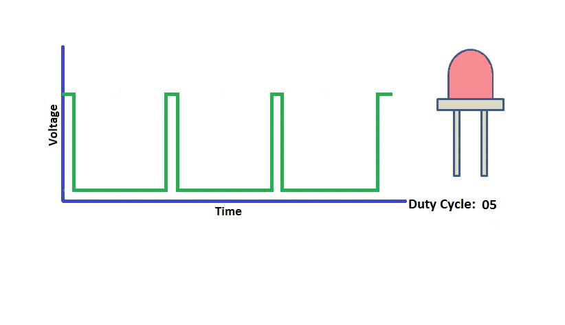

- **Cycle**: The time of a pulse signal. Frequency is the number cycles in 1s.

- **Pulse width time**: high level time.

**The GPIO ports that outputs PWM on kidsuno: D3, D5, D6, D9, D10, D11.**

In this experiment, the motor we use is designed two control ports: INA and INB.

When the PWM of INA is greater than that of INB, the motor rotates counterclockwise. The greater the difference value is, the faster the speed will be.

When the PWM of INB is greater than that of INA, the motor rotates clockwise. The greater the difference value is, the faster the speed will be.

When both INA and INB are 0, the rotation stops.

In this experiment, we connect the module to port 9. According to the board ports view, we connect the motor INA pin to D10 and INB to D11.

#### Wiring Diagram

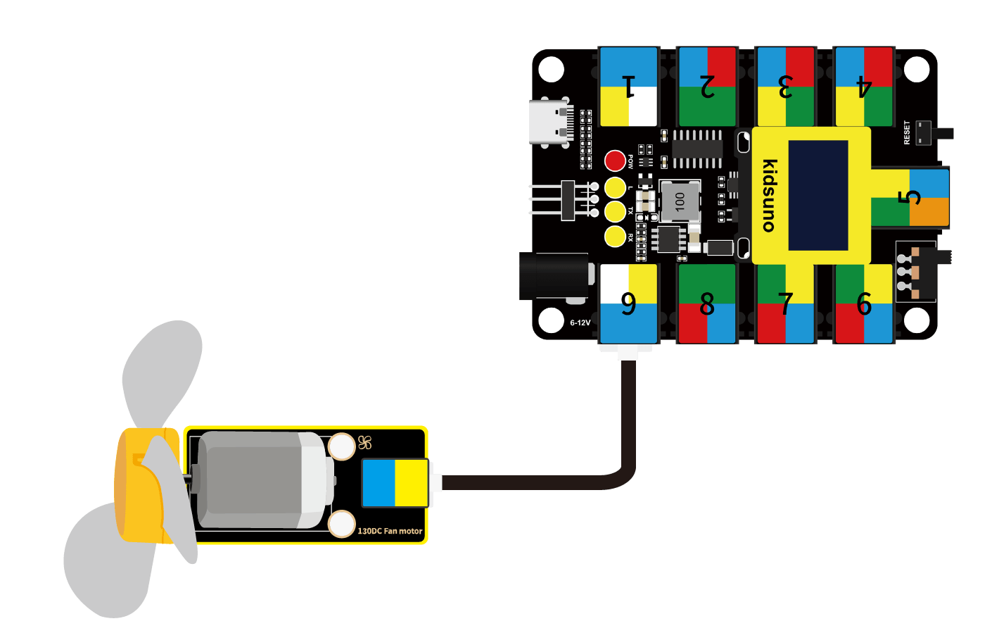

#### Test Code

Open KidsBlock and connect the board to computer. Choose **File --> Load from your computer**.

Choose path D:\Code\1.Code_kidsuno and open **3.9Motor.sb3**.

Click  to connect to port and then . 

#### Explanations

**Code Blocks**

|            Blocks             |                    Code block                     |
| :---------------------------: | :-----------------------------------------------: |
|    |                          |
|      |  |
|  |                      |
|  |                            |

**Build blocks:**

Click  to add library **DC Motor**.

1. **Initialization**

   Initialize the motor and zero out INA and INB.

   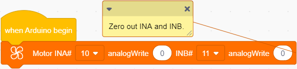

2. **Main Code**

   Loop: The fan rotates clockwise at a full speed for 2s, at a slowing down speed for 2s, and then stops for 2s. After that, it performs the same actions but in different direction: it rotates counterclockwise.

   

    

   **Build blocks:**

   ① 

   ② Add  and  together in "forever".

   Duplicate them five times.

   

   

   So there will be six groups in total.

   (1) 

   The PWM value of INA is 0; The PWM value of INB is 255. The PWM of INB is greater than that of INA, so the motor rotates clockwise. The greater the difference value is, the faster the speed will be.

   (2) 

   The PWM value of INA is 0; The PWM value of INB is 100. The PWM of INB is greater than that of INA, so the motor rotates clockwise. The difference is smaller than Group One, so the speed will be lower.

   (3) 

   The PWM value of INA and INB are both 0, so the motor stops working.

   (4) 

   The PWM value of INA is 255; The PWM value of INB is 0. The PWM of INA is greater than that of INB, so the motor rotates counterclockwise. The greater the difference value is, the faster the speed will be.

   (5) 

   The PWM value of INA is 255; The PWM value of INB is 100. The PWM of INA is greater than that of INB, so the motor rotates counterclockwise. The difference is smaller than Group Four, so the speed will be lower.

   (6) 

   The PWM value of INA and INB are both 255, so the motor stops working.

#### Test Result

**WARNING: Do not hold the fan with your hand before uploading the code. When using, please face the fan to an open place to avoid injury.**

After uploading code, the fan rotates clockwise at a full speed for 2s, at a slowing down speed for 2s, and then stops for 2s. After that, it performs the same actions but in different direction: it rotates counterclockwise.

---

### 3.10 IR Receiver

Infrared remote control is one of the most widely used means of communication and remote control. 

IR remote control devices features small size, low power consumption, multiple functions and low cost, so that it is integrated in various equipments, such as recorders, audio equipments and air conditioners.

Herein, the internal IC of this module has been tuned. The receiver outputs digital signals and can receive the standard 38KHz modulated remote control signals.

#### Parameters

Operating voltage: DC 3.3 ~ 5V

Operating current: 1.5 mA

Maximum power: 0.0075 W

Carrier frequency: 38 KHz

Wave length: 940 λp(nm)

Receiving distance: 6m at 45°; 14m in parallel.

Operating temperature: -10°C ~ +50°C

Dimensions: 24 x 48 x 33.4 mm (without housing)

Positioning holes: diameter of 4.8 mm

Interface: telephone socket

#### Principle

The transmitting circuit is composed of infrared light-emitting diode, which emits the modulated infrared light wave.

The receiving circuit includes an infrared receiving diode, a triode, or a silicon photocell, which receives the modulated infrared light waves emitted by the transmitter and then converts them into electrical signals. After that, these electrical signals are amplified, filtered and demodulated to restore the encoded instruction signals. The decoded signals can be read and recognized by the board as to perform corresponding operations.

Modules with blue housing are digital ones, so we should connect to digital io pins of the mainboard (ports with blue).

In this experiment, we connect the module to port 1. According to the board ports view, the digital io pin at port 1 is D5.

#### Wiring Diagram

#### Test Code

Open KidsBlock and connect the board to computer. Choose **File --> Load from your computer**.

Choose path D:\Code\1.Code_kidsuno and open **3.10Infrared Receiver.sb3**.

Click  to connect to port and then .

#### Explanations

**Code Blocks**

|            Blocks             |              Code block               |
| :---------------------------: | :-----------------------------------: |
|    |              |
|    |  |
|    |  |
|            |            |
|            |  |
|            |          |
|            |    |
|  |          |
|  |                    |
|  |                |

**Build blocks:**

Click  to add library **ir remote**.

1. **Initialization**

   Initialize the serial monitor and set the IR receiver pin to 5.

   

2. **Main Code**

   Loop: Receive the data from IR receiver, and print them on the serial monitor in the format of HEX(hexadecimal). 

   

    

   **Build blocks:**

   ① 

   ② Add  in the condition box of .

   ③ Put  in "if" and set the printing contents to .

   

   When the receiver receives messages, they will be printed on the serial monitor.

   ④ Add a delay  in "if" and set the delay time to 0.5s. A delay will eliminate the button jitters.

   If we do not add a delay, the monitor may outputs some messy strings.

   
   
   ⑤  refreshes the received data. Without this block, the serial monitor will always print the received data. The module only receives new data after being refreshed.
   

#### Test Result

Before using the infrared remote control, please firstly remove the transparent insulation sheet at the bottom.

Decimal Code of Remote Control

NOTE: Before uploading code, please set baud rate first to avoid garbled words.

Click  to set the Buadrate to 9600.

After uploading code, align the remote control with the receiver and press any key on it. After receiving signals, the serial monitor prints the corresponding key value, meanwhile, the LED on the infrared receiver flashes.

---

## 4. Comprehension

### 4.1 Temperature Detection

The fan will monitor the operating temperature. When it is overheat, the fan will start to rotate automatically. 

This temperature detection device adopts a DS18B20 temperature sensor and an 130 motor.

#### Flow

#### Assembly

**Required Components**

**Step 1**

**Step 2**

**Step 3**

**Step 4**

**Step 5**

**Step 6**

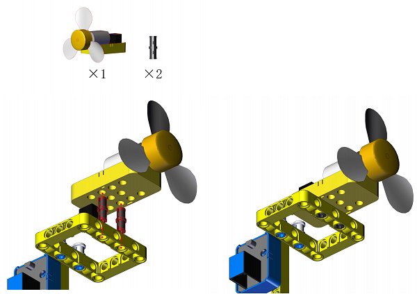

**Completed**

#### Wiring Diagram

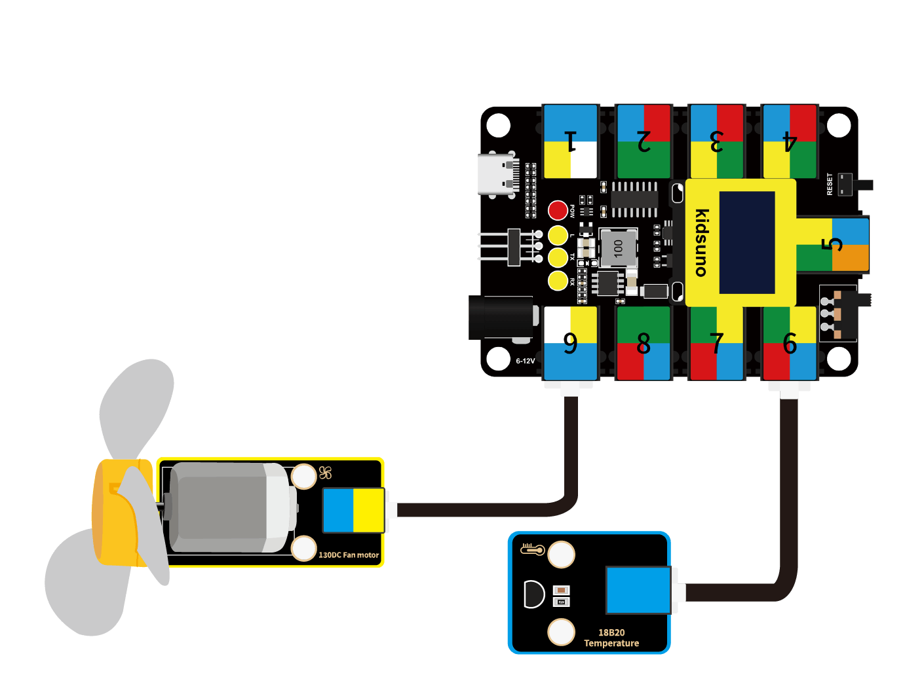

#### Test Code

Open KidsBlock and connect the board to computer. Choose **File --> Load from your computer**.

Choose path D:\Code\1.Code_kidsuno and open **4.1Temperature detection.sb3**.

Click   to connect to port and then .

#### Explanations

**Code Blocks**

|              Blocks               |                    Code block                     |
| :-------------------------------: | :-----------------------------------------------: |
|        |                          |
|            |            |
|            |              |
|            |                    |
|        |              |
|        |              |
|            |              |
|  |                      |
|          |  |
|      |                      |
|      |                        |

**Build blocks:**

Click  to add libraries **18b20** and  **DC Motor**.

1. **Initialization**

   Initialize the serial monitor.

   

2. **Main Code**

   Loop: DS18B20 sensor reads the temperature values and the serial monitor prints them. Then, it determines whether the value is greater than 30°C(this threshold is adjustable).

   - Temperature > 30: fan rotates to cool down.
   - Temperature < = 30: fan stops working.

   

#### Test Result

After uploading code, the fan will rotate for cooling down when the temperature value exceeds 30°.

You can raise the temperature by pinching the DS18B20 sensor with your finger or lighting a lighter near the sensor. 

**WARNING: Please use lighters with the guidance of an adult!**

---

### 4.2 Trigger Mode

We design to trigger the fan to automatically work when something approaches to it. This trigger mode integrates an ultrasonic sensor and an 130 motor.

#### Flow

#### Assembly

**Required Components**

**Step 1**

**Step 2**

**Step 3**

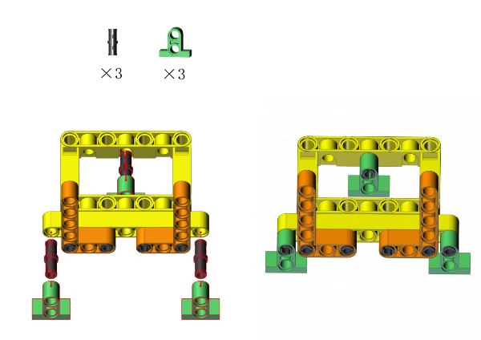

**Step 4**

**Step 5**

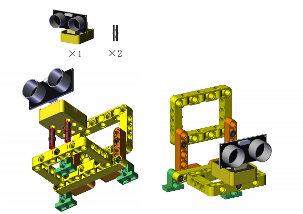

**Step 6**

**Completed**

#### Wiring Diagram

#### Test Code

Open KidsBlock and connect the board to computer. Choose **File --> Load from your computer**.

Choose path D:\Code\1.Code_kidsuno and open **4.2Trigger mode.sb3**.

Click  to connect to port and then .

#### Explanations

**Code Blocks**

|              Blocks               |                    Code block                     |
| :-------------------------------: | :-----------------------------------------------: |
|        |                          |
|            |            |
|            |              |
|            |                    |
|        |              |
|        |              |
|                  |                |
|  |                            |
|          |  |
|      |                      |
|      |                        |
|      |                            |

**Build blocks:**

Click  to add libraries **DC Motor** and **Ultrasonic**.

1. **Initialization**

   Initialize the serial port.

   

2. **Main Code**

   Loop: the ultrasonic sensor reads the distance values and the serial monitor prints them. It determines whether the value is less than 10cm(this threshold can be modified).

   - Distance < 10, fan rotates.
   - Distance > = 10, fan stops.

#### Test Result

After uploading code, approach to the ultrasonic sensor. When the ultrasonic sensor detects things around itself with a distance less than 10, the fan will rotate. If the distance equals or is greater than 10, the fan will stop rotating.

---

### 4.3 Remote Control Mode

In this project, we utilize an IR receiver and an 130 motor to construct a remote control fan, whose startup and rotation speed are controlled by a infrared remote control. 

#### Flow

 

#### Assembly

**Required Components**

**Step 1**

**Step 2**

**Step 3**

**Step 4**

**Step 5**

**Completed**

#### Wiring Diagram

#### Test Code

Open KidsBlock and connect the board to computer. Choose **File --> Load from your computer**.

Choose path D:\Code\1.Code_kidsuno and open **4.3Remote control.sb3**.

Click to connect to port and then .

#### Explanations

**Code Blocks**

|              Blocks               |                    Code block                     |
| :-------------------------------: | :-----------------------------------------------: |
|        |                          |
|            |            |
|            |              |
|            |                |
|            |                    |
|                |                        |
|                |              |
|                |                      |
|                |                |
|  |                                  |
|  |                              |
|          |  |
|      |                      |
|      |                        |
|      |                                |

**Build blocks:**

Click  to add libraries **DC Motor** and **ir remote**.

1. **Initialization**

   Define four variables with initial values of 0: *key1_press_num*; *key2_press_num*; *key3_press_num*; *key*.

   The first three variables are used to store the pressing times of key 1, key 2 and key 3; the last one records the data received by IR receiver.
   
   Zero out INA and INB, and initialize the IR receiver pin IO13.
   
   

2. **Main Code**

   Loop: Press key 1, key 2 and key 3, the fan will rotates at different speed. Press again, the fan stops. These three speeds can have a switchover without stopping the fan.

   
   
    
   
   **Build blocks:**
   
   ① Build blocks as follows: 
   
   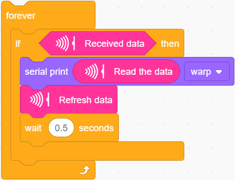
   
   When an infrared signal is received, assign the received value to the variable *key* and then refresh the received value.
   
   ② Add blocks as follows: It determines whether the key 1 is pressed.
   
   
   
   If *key* = 16738455 (key 1 is pressed), *key1_press_num* will adds one, and *key2_press_num* and *key3_press_num* will zero out.
   
   ③ Add blocks as follows:
   
   
   
   These code blocks determine whether the remainder of *key1_press_num* divided by 2 equals 1.
   
   - remainder = 1: fan rotates.
   - remainder ≠ 1: fan stops. 
   
   ④ Put these blocks together: 
   
   
   
   For this whole, the fan will rotate at a high speed if key 1 is pressed; it stops when key 1 is pressed again. 
   
   **Analysis:**
   
   Press key 1 once, *key1_press_num*(initial value is 0) adds one, and *key2_press_num* and *key3_press_num* zero out.
   
   Determine whether the remainder of *key1_press_num* divided by 2 equals 1: herein, 1 ÷ 2 = 0......1, so the condition is met, and the fan rotates at high speed.
   
   Press key 1 again, *key1_press_num* adds one. Now it equals 2, and the other two values is 0.
   
   Determine whether the remainder of *key1_press_num* divided by 2 equals 1: herein,  2 ÷ 2 =1......0, so the condition is not satisfied, and the fan stops.
   
   ⑤ Duplicate the "if" block in ④ twice.
   
   
   
   As follows: 
   
   
   
   The working principles are the same. These two copies are used to control key 2 and key 3. For key 2, the fan will rotates at a medium speed; For key 3, it is at low speed.
   
   ⑥ Drag blocks of ⑤ into ①, as follows:
   
   
   
   When infrared signals are received, determine whether they are the decimal codes of key 1, key 2 and key 3.
   
   Then, determine the number of pressing time is odd or even. Odd: the fan rotates at corresponding speed; Even: fan stops.
   
   
   
   Q ：Why zero out the other two variables? 
   
   These three keys work according to the same principle. When the pressing times is an odd number, the fan rotates; otherwise, the fan stops. 
   
   If we do not zero out them, we cannot make sure every time these three speeds can have a switchover without stopping the fan. This is because we have no idea whether the value of the other two is always even, so the fan may change speed or stop when we press another key. We zero out  them when we press one key, therefore the fan can immediately change its speed without stopping when we press another key. 
   
   A :  This step ensures that, after we press one key, the values of the other two are always even, so that these three speeds can have a switchover without stopping the fan.
   
   

#### Test Result

After uploading code, we can control the startup and speed of the fan via the remote control.

Key 1: high speed

Key 2: medium speed

Key 3: low speed

These three speeds can have a switchover without stopping the fan. Press the same key again and the fan will stop.

---

### 4.4 Manual Control Mode

In this project, we adopt a capacitive touch sensor and an 130 motor to combine a fan in manual mode. We can control the startup of the fan by the capacitive touch sensor.

#### Flow

#### Assembly

**Required Components**

**Step 1**

**Step 2**

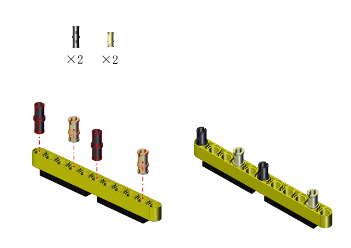

**Step 3**

**Step 4**

**Step 5**

**Step 6**

**Completed**

#### Wiring Diagram

#### Test Code

Open KidsBlock and connect the board to computer. Choose **File --> Load from your computer**.

Choose path D:\Code\1.Code_kidsuno and open **4.4Manual mode.sb3**.

Click  to connect to port and then .

#### Explanations

**Code Blocks**

|              Blocks               |                    Code block                     |
| :-------------------------------: | :-----------------------------------------------: |
|        |                          |
|                  |                      |
|                  |              |
|            |            |
|            |              |
|            |                    |
|  |                                  |
|  |                              |
|          |  |
|      |                      |
|      |                                |
|      |                            |

**Build blocks:**

Click  to import library **DC Motor**.

1. **Initialization**

   Set the sensor pin to D2. Define a variable press with an initial value of 0 to monitor the state of motor.

   

2. **Main Code**

   Loop:

   - When the module is touched (D2 reads 1) and press = 0, the fan rotates, and press will be reassigned to 1.
   - When the module is touched (D2 reads 1) and press = 1, the fan stops, and press will be reassigned to 0.

   

#### Test Result

After uploading code, touch the module and the fan starts to work. Touch it again, and the fan will stop.

---

### 4.5 Variable Speed Mode

In this experiment, we build a small fan with variable rotation speed: 40%, 60%, 80% and 100%. The required modules are a five-channel AD button module (speed control) and an 130 motor. 

#### Flow

#### Assembly

**Required Components**

**Step 1**

**Step 2**

**Step 3**

**Step 4**

**Step 5**

**Step 6**

**Completed**

#### Wiring Diagram

#### Test Code

Open KidsBlock and connect the board to computer. Choose **File --> Load from your computer**.

Choose path D:\Code\1.Code_kidsuno and open **4.5Gearshift mode.sb3**.

Click  to connect to port and then .

#### Explanations

**Code Blocks**

|              Blocks               |                    Code block                     |
| :-------------------------------: | :-----------------------------------------------: |
|        |                          |
|                  |                      |
|                  |                |
|        |              |
|        |              |
|            |            |
|            |              |
|            |                    |
|  |                            |
|  |                      |
|  |                              |
|          |  |
|            |                              |
|      |                      |
|      |                                |
|      |                            |

**Conceive:**

1. **Initialization**

   Set pin mode and initialize the serial port.

   

2. **Main Code**

   Loop:

   - Press button 5 to adjust the speed to 40%.
   - Press button 4 to adjust the speed to 60%.
   - Press button 3 to adjust the speed to 80%.
   - Press button 2 to adjust the speed to 100%.
   - Press button 1 to stop the fan.

   

**Build blocks:**

The code structure is similar to that in chapter 3.8. 

In addition, here we adopt a map block to configure the motor PWM.

Q ：What is MAP?

A ：In mathematics, MAP is the term for a relationship between two sets of elements that "correspond" to each other.

Set: a whole consisting of one or more defined elements.

There is a correspondence between Set A and B. For every Element a in Set A, there is always a unique element b corresponding to it in Set B, which is called map A to B.

The concept of mapping is not only used in mathematics, but in computer science. In a computer program, mapping is a way to map each element in one set to a unique element in another.

In chapter 3.9, we know that the rotation speed is effected by PWM duty cycle.

The range of PWM is 0 ~ 255. When PWM=255, the speed is at maximum. In this experiment, we set the speed range from 0 to 100, and map the speed values to PWM by the map block.

Divide PWM equally into 100 parts, so each part is 2.55, which corresponds to 1 speed.

- Maximum unit of PWM: 2.55
- Maximum unit of speed: 1

The speed value multiplied by 2.55 equals the corresponding PWM value: 

$ PWM{v}= \frac {255-0}{100-0}*V$ 

In a map block, five operators need to be set:

- The first is the value being mapped, here it is the speed value.
- The second and third are the range of the value being mapped, here is the speed range.
- The forth and fifth are the range of the mapping value, here is the range of motor PWM.

 returns the PWM value of speed of 40.

Put it into  to set the mapped value to the duty cycle of the motor, so that the motor will rotate at the speed of 40%.

Similarly, we duplicate this block and set speed value (the first operator in map block) to 60, 80 and 100 to make the fan work at the speed of 60%, 80% and 100%.

This map block can directly set the range of mapped values and of mapping values, so we only need to modify the mapped values without calculating the corresponding mapping values one by one.

#### Test Result

After uploading code, press button 5 - 2 orderly, and the fan speed will be adjusted to 40, 60, 80,100 accordingly. When you press button 1, the fan turns off.

---
