# Smart Fan for Kidspico


## 1. Code and Firmware

[DOWNLOAD](../Code.zip)

Download and unzip these files. Here all codes are in folder **3.Code_kidspico** and firmware is at  **3.Firmware_kidspico**.

For convenience, <span style="color: rgb(2550, 10, 50);">we move the codes into: **D:\Code\3.Code_kidspico**.</span> You can also choose to move it into any disks at will. 

---


## 2. Development Environment Configuration

### 2.1 Thonny Download

#### Windows

**We demonstrate on Windows 10.**

Download: [Thonny Official](https://thonny.org)

Click **Windows** to choose one version to download.


#### MAC

Similar to Windows.


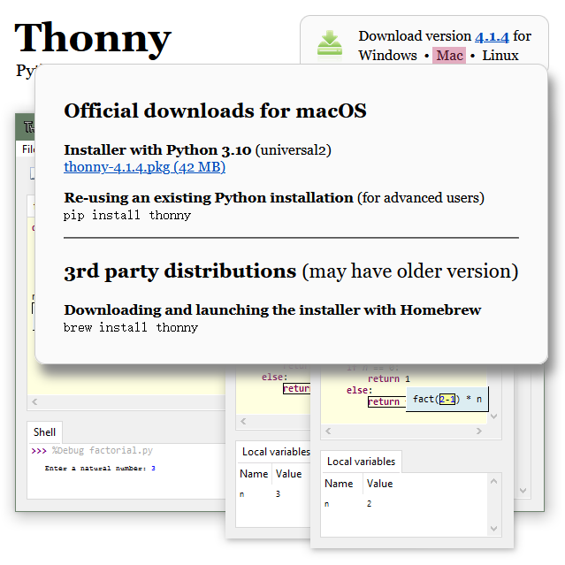

### 2.2 Thonny Installation

Two methods:

- Install Thonny+Python package

  Recommended for beginners: When you install, the Python environment and Thonny will be packaged so both installed. There are also two ways to install the package:

  - Installer

    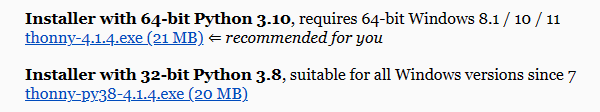

  - Portable variant

    

- Install Thonny only

  Recommended for developers: When the user already has a python environment, `pip install thonny` comes in handy to install Thonny separately.

  

Please just install according to your needs.

#### Installer

Here we demonstrate how to install `Installer with 64-bit Python 3.10` on <span style="background:#ff0;color:#000">64bit Windows 10</span>.

（1）After downloading, click . And you will see **Select Setup Install Mode**, choose **Install for me only**.


（2）**Next**.

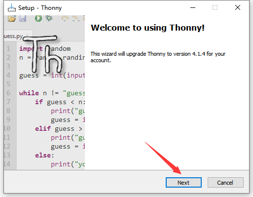

（3）Tick **I accept the agreement** and **Next**.


（4）The default path is Disk C, or you can click **Browse...** to modify the path. After that, click **Next**.


（5）Choose a path to create the program's shortcuts, and click **Next**.


（6）Tick **Create desktop icon** and click **Next**.


（7）Inatall.

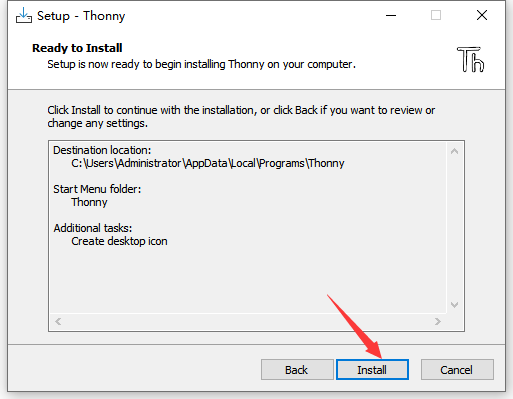

（8）“**Finish**”.


（9）Open Thonny and choose your language.

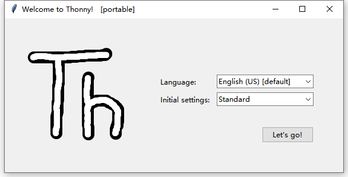

（10）Main interface:


#### Portable Variant

Here we demonstrate how to install `Portable variant with 64-bit Python 3.10` on <span style="background:#ff0;color:#000">64bit Windows 10</span>.

（1）After downloading and being unzipped, click  to choose your language.


（2）Main interface:


（3）For convenience, please send  to Desktop(create shortcut).


Shortcut: 

---

### 2.3 Firmware

Press and hold the BOOT button on the kidspico mainboard, connect it to PC via USB cable and then release the BOOT button. 

A removable hard disk will show up.

Open folder **3.Firmware_kidspico**, find and copy the firmwareinto this disk.


After that, open Thonny to connect to port (COM number varies from devices). 


---

### 2.4 Thonny

#### Interface

Click **View** and tick **Files** to open the file path management.

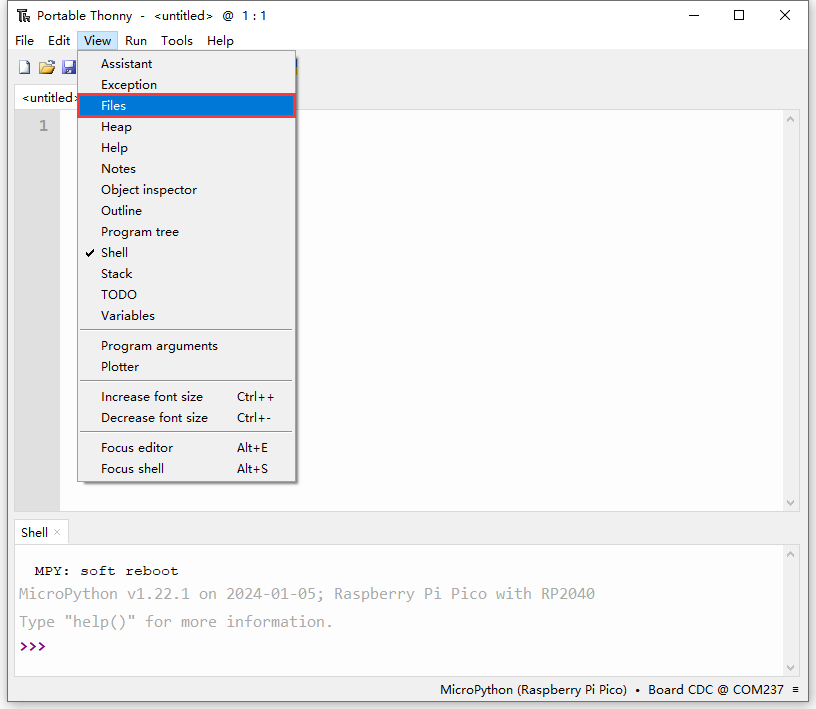


#### Toolbar


|          ICON           |            FUNCTION            |
| :---------------------: | :----------------------------: |
|  |          New (Ctrl+N)          |
|  |        Open... (Ctrl+O)        |
|  |         Save (Ctrl+S)          |
|  |    Run current script (F5)     |
|  |      Debug current script      |
|  |         Step over (F6)         |
|  |         Step into (F7)         |
|  |            Step out            |
|  |          Resume (F8)           |
|  | Stop/Restart backend (Ctrl+F2) |

---

### 2.5 Test

<span style="color: rgb(2550, 10, 50);">Please download and unzip code files and save them in a path as your need. For instance, **D:\Code\3.Code_kidspico**.</span>

In Files, click **This computer**.


Enter **Disk D** and open folder **Code**, find **3.Code_kidspico** and you will see all codes.

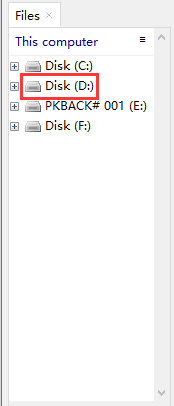  

Connect to kidspico and choose COM port. 


#### Test Shell Command

Input the following code in Shell.

```python
print('hello world')
```


Press "Enter" and the Shell prints **hello world**.


---

#### Test Online Running

Click to open code **Onboard_LED.py**.

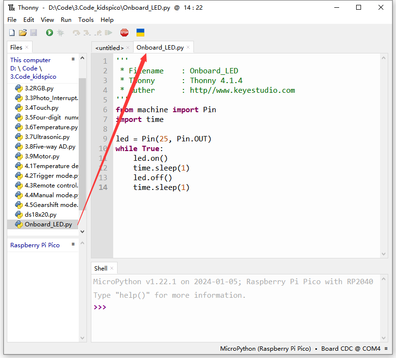

Click  to run the code, and the yellow LED on kidspico board will flashes: on for 1s and off for 1s.


---

#### Test Offline Running

Open **Onboard_LED.py** in Files: File --> Save as... 

Click  to create a new script, copy and paste Onboard_LED.py in it.


Click  to save it to Raspberry Pi Pico.


We name it as **main.py**.

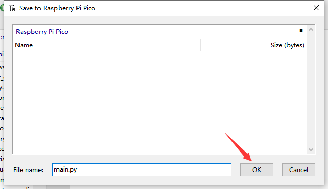

After saving, the main.py code will automatically execute as long as the kidspico board is powered on. You will see the yellow LED flashes per second. 


---

## 3. Modules

<span style="color: rgb(2550, 10, 50);">Please move the codes to a convenient path as your needs, for instance, path: **D:\Code\3.Code_kidspico**.</span>

### Kidspico Ports View

During experiments, <span style="color: rgb(2550, 10, 50);">modules can only be connected to ports in the same color.</span>


### 3.1 White LED Module


**LED (Light-Emitting Diode)**

LED is a commonly used light emitting device that converts electrical energy into light energy. Usually, it is used as an indicator in circuits and instruments, or as part of texts or numeric display.

It generally includes gallium(Ga), arsenic(As), phosphorus(P), nitrogen(N) and so on. 

|     LED components      | Emitting light colors |
| :---------------------: | :-------------------: |
| gallium arsenide diode  |          red          |
| gallium phosphide diode |         green         |
|  silicon carbide diode  |        yellow         |
|  gallium nitride diode  |         blue          |


#### Parameters


Operating voltage: DC 3.3 ~ 5 V

Operating current: 1.5 mA (Peak: 2.3mA)

Maximum power: 0.07 W

Control signal: digital signal

Dimensions: 24 x 48 x 18 mm (without housing)

Positioning holes: diameter of 4.8 mm

Interface: telephone socket


#### Principle


Modules with blue housing are digital ones, so we should connect to digital io pins of the mainboard (ports with blue).

In this experiment, we connect the white LED module to port 1. According to the board ports view, the digital io pin at port 1 is io11.

When we set the pin to high(1), the LED lights up in white; if we set to low(0), it will be off.


#### Wiring Diagram


#### Test Code

Open Thonny and connect to COM port. Open **3.1Light_on.py** in **Files** and click .

```python
'''
 * Filename    : Light_on
 * Thonny      : Thonny 4.1.4
 * Auther      : http//www.keyestudio.com
'''
from machine import Pin
import time

led = Pin(11, Pin.OUT)# led object. connect it to pin 11 and set pin to output
while True:
    led.on()     # led on
    time.sleep(1)# delay 1s
    led.off()    # led off
    time.sleep(1)# delay 1s
```

#### Explanations


1. `from machine import Pin`

   Import Pin from machine to enable its functions.


  **machine.pin **

```python
machine.Pin(id,mode,pull,value)
```


   - id ：GPIO number, within 0-29. For example, if you enable GPIO11, fill in with 11.

   - mode ：pin mode can be one of the followings:

	​	Pin.IN(0) - set pin to input

	​	Pin.OUT(1) - set pin to (normal)output

	​	Pin.OPEN_DRAIN(2) - set pin to open drain output

   - pull ：specifies whether the pin is connected to a (weak-)pull resistor; it is valid only at input mode, and can be one of the followings:

	​	None - no pull-up/down

	​	Pin.PULL_UP(1) - enable pull-up resistor

	​	Pin.PULL_DOWN(2) - enable pull-down resistor

   - value ：only work at Pin.OUT and Pin.OPEN_DRAIN mode; assign the initial output pin value. Or else, the peripheral state of the pin stays still. 0 is low(off) while 1 is high(on).

   - Pin.on() - set pin to high

   - Pin.off() - set pin to low


2. `import time`

   Import **time** type so that its related functions can be adopted.


3. `led = Pin(11, Pin.OUT)`

​	Set LED pin io11 to output mode.


Q ：Why "output"?

A ：The code is written for the mainboard. For the board, pin io11 is outputting power levels (high or low) to the connected module.


4. `while True:`

   Statements in this function will execute in a loop.

   Formula of while loop function:

```python
while (condition)：
    (statements)……
```


5. `led.on()` & `led.off()`

   At pin io11 on the mainboard, respectively output high(1) and low(0); i.e., output high(1)/low(0) to LED module to make it on/off.


6. `time.sleep(1)` 

   Delay 1s.

   

   Q ：Why delay?

   A ：If you output a high level to LED, it will be always on. Yet, we add a delay of 1s, so it lights up for only 1s. Delay time is the ON/OFF time of LED.
   
   


#### Test Result


After uploading code, the LED module will flash with an interval of 1s (on for 1s and off for 1s).


Click  or Ctrl+C to exit the execution.


---

### 3.2 RGB LED Module (Common Anode)


RGB LED is imaged in the intersection of three primary colors (RGB): red, green and blue. Both white LED and RGB LED are able to emit white light. The former is presented directly in white, while the latter is mixed with red, green and blue.

**Trichromatic Theory**


Human eyes are sensitive to RGB colors. Most colors can be synthesized by RGB in different proportions. Therefore, the vast majority of monochromatic light can also be decomposed into RGB colors. This is the most basic principle of colorimetry --- trichromatic theory.

Red, green and blue lights are called additive primary colors because by the combination of these three primaries in different proportion, various colored lights will produce. Similarly, there are also subtractive ones. So we may add or/and subtract colors as needed. 

The three primary colors of the paint can not compose white, yet, with optical elements, those of light can do it, which is mixed by the three equal parts of RGB.


#### Parameters


Operating voltage: DC 3.3 ~ 5V 

Current: 19.5 mA

Maximum power: 0.975 W

Operating temperature: -10°C ~ +50°C

Dimensions: 24 x 48 x 18 mm (without housing)

Positioning holes: diameter of 4.8 mm

Interface: telephone socket


#### Principle


This RGB LED integrates 3 LED inside: red, green and blue.

This RGB LED diode is designed with 4 pins, among which three control LED pins of R, G and B, and one is common anode, which need to be connect to power positive.

When using, we need to connect this module to the white ports of the mainboard.

In this experiment, we connect the RGB LED module to white port 2. According to the board ports view, R pin is connect to io7, G to io8 and B to io9.

When we set the pins to high(1), the LED lights up in corresponding color; if we set to low(0), it will be off.


#### Wiring Diagram


#### Test Code

Open Thonny and connect to COM port. Open **3.2RGB.py** and click .

```python
'''
 * Filename    : RGB
 * Thonny      : Thonny 4.1.4
 * Auther      : http//www.keyestudio.com
'''
from machine import Pin
import time

red = Pin(7, Pin.OUT)
green = Pin(8, Pin.OUT)
blue = Pin(9, Pin.OUT)

while True:
    #RGB LED lights u in red for 1 second
    red.on()      #Red LED light
    time.sleep(1) #dalye 1s
    red.off()     #Red LED off
    
    #RGB LED lights up in green for 1 second
    green.on()
    time.sleep(1)
    green.off()
    
    #RGB LED lights up in blue for 1 second
    blue.on()
    time.sleep(1)
    blue.off()
    
    #RGB LED lights up in white for 1 second
    red.on()
    green.on()
    blue.on()
    time.sleep(1)
    red.off()
    green.off()
    blue.off()
```

#### Explanations


1. `red = Pin(7, Pin.OUT)`

   connect red LED to pin io7, and set the pin to output. Similarly, we set green and blue LED pins.


2. ```python
   #RGB LED lights up in red for 1 second
   red.on()      #Red LED on
   time.sleep(1) #dalye 1s
   red.off()     #Red LED off
   ```

   `red.on()` : red led lights up

   `time.sleep(1)` : red led lights up for 1s.

   `red.off()` : red led goes off. This step is indeed. Or else, other colors of light may be effected by red.


3. ```python
   #RGB LED lights up in white for 1 second
       red.on()
       green.on()
       blue.on()
       time.sleep(1)
       red.off()
       green.off()
       blue.off()
   ```

   In this code, we turn on red, green and blue LED at the same time so that the module will light up in white. A second later, it turns off.


####  Test Result


After uploading code, the RGB LED will circulate to light up in red, green, blue and white respectively, each color for 1s, in a circulation.


Click  or Ctrl+C to exit the execution.


---

### 3.3 Photo Interrupter


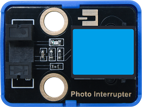

Photo interrupter works based on photoresistor and light source. 

Generally, this module is composed of two photoelectric components: light source and the light receiver. The light source is usually an LED, while the light receiver consists of a photosensitive element and a signal amplifier. When light is blocked, the photosensitive element receives no light, so its resistance value changes. This change will be converted into an electrical signal and then processed.


#### Parameters


Operating voltage: DC 3.3 ~ 5V 

Operating current: 24 mA

Maximum power: 0.12 W

Operating temperature: -10°C ~ +50°C

Control signal: digital signal

Dimensions: 24 x 32 x 18 mm (without housing)

Positioning holes: diameter of 4.8 mm

Interface: telephone socket


#### Principle


Modules with blue housing are digital ones, so we should connect to digital io pins of the mainboard (ports with blue).

In this experiment, we connect the module to port 3. According to the board ports view, the digital io pin at port 3 is io3.

When objects block lights, the module outputs high; if not, it outputs low.


#### Wiring Diagram


#### Test Code

Open Thonny and connect to COM port. Open **3.3Photo_Interrupt.py** and click .

```python
'''
 * Filename    : Photo_Interrupt
 * Thonny      : Thonny 4.1.4
 * Auther      : http//www.keyestudio.com
'''
from machine import Pin
import time

PI = Pin(3, Pin.IN)
lastState = 0
PushCounter = 0

while True:
    State = PI.value()
    if  State != lastState:
        if State == 1:
            PushCounter += 1
            print(PushCounter)   
    lastState = State
```

#### Explanations


1. `PI = Pin(3, Pin.IN)`

   Connect the photo interrupter to pin io3 and set the pin to input.


2. | operator | description                                                  |
   | :------: | ------------------------------------------------------------ |
   |    !=    | not equal. Determine whether the two objects are not equivalent to each other.<br>If they are, output True. If not, output False. |
   |    ==    | equal. Determine whether the two objects are equivalent to each other.<br>If they are, output True. If not, output False. |
   |    +=    | addition assignment operator. Add the two values and then assign the final value to the left one.<br>For instance, **c += a** means **c = c + a**. |


3. `if  State != lastState:`

   Determine whether State does not equal lastState. 

   If yes, return True; If they equals each other, return False.

   **if statement**

   if condition statement: run different codes according to the condition(s) (True/False).

   As follows: 

   

   Regular formula of **if statement**:
   
   ```python
   if condition_1:
       statement_block_1
   elif condition_2:
       statement_block_2
   else:
       statement_block_3
   ```

   If "condition_1" is True, execute "statement_block_1".

   If "condition_1" is False, execute "condition_2".

   If "condition_2" is True, execute "statement_block_2".
   
   If "condition_2" is False, execute "statement_block_3".


4. ```python
   while True:
       State = PI.value()
       if  State != lastState:
           if State == 1:
               PushCounter += 1
               print(PushCounter)   
       lastState = State
   ```

   This code records how many time the light is interrupted.

   In these code, a **nested-if structure** is adopted: an **if statement** in another **if**. Let's have a look at the operational logic diagram:

   

   ① Assign the value output by the photo interrupter to State

   ② Determine whether State ≠ lastState

   - State ≠ lastState: execute the next if statement
   - State = lastState: exit if loop to execute ⑤
   
   ③ (Precondition: State ≠ lastState) Determine whether State = 1

   - State = 1: PushCounter +1 and output it.
   - State ≠ 1: exit if loop.
   
   ④ (Precondition: State ≠ lastState, State = 1) PushCounter +1 and print the value on Shell.

   ⑤  Assign the value of State to lastState

   

   Initial Settings:

   | Initial state                                                |          |
   | ------------------------------------------------------------ | -------- |
   | State: the present value output by the sensor signal terminal | set to 0 |
   | lastState: the last value output by the sensor signal terminal | set to 0 |
   | PushCounter: the number of times of light being interrupted  | set to 0 |

   Execution:

   | State                                      |                                                              |
   | ------------------------------------------ | ------------------------------------------------------------ |
   | the object passes through the groove once  | the initial value of lastState is 0; State detects object so its value is 1.<br>State ≠ lastState, State = 1<br>PushCounter+1, and output the value.<br/>lastState = State, lastState = 1 |
   | the object leaves from the groove          | lastState = 1; State detects no object so its value is 0.<br>State ≠ lastState, State = 0<br>lastState = State, lastState = 0 |
   | the object passes through the groove again | lastState = 0; State detects object so its value is 1.<br />State ≠ lastState, State = 1<br/>PushCounter+1, and output the value.<br/>lastState = 1 |
   | the object leaves from the groove          | lastState = 1; State detects no object so its value is 0.<br>State ≠ lastState, State = 0<br/>lastState = 0 |


#### Test Result


After uploading code, place an opaque object in in the sensor groove and then remove it, so the light will be interrupted once. Shell will print the number of times of light being interrupted. 


Click  or Ctrl+C to exit the execution.


---

### 3.4 Capacitive Touch Sensor


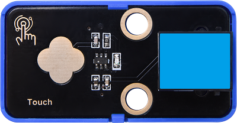

On the capacitive touch sensor, a touch switch is reserved to enable switch function through its variable area.

After powering on, the sensor requires about 0.5 seconds to stabilize itself. During this time, please do not touch it. Its all functions are disabled due to a self-calibration, whose cycle is about 4 seconds.


#### Parameters


Operating voltage: DC 3.3 ~ 5V 

Operating current: 3 mA

Maximum power: 0.015 W

Operating temperature: -10°C ~ +50°C

Input signal: digital signal

Dimensions: 24 x 48 x 18 mm (without housing)

Positioning holes: diameter of 4.8 mm

Interface: telephone socket


#### Principle


Modules with blue housing are digital ones, so we should connect to digital io pins of the mainboard (ports with blue).

In this experiment, we connect the module to port 4. According to the board ports view, the digital io pin at port 4 is io2.

When we touch the capacitive area on the sensor, the sensor outputs high(1) and the on-board red LED lights up; when we release, it outputs low(0) and the LED goes off.


#### Wiring Diagram


#### Test Code

Open Thonny and connect to COM port. Open **3.4Touch.py** and click .

```python
'''
 * Filename    : Touch
 * Thonny      : Thonny 4.1.4
 * Auther      : http//www.keyestudio.com
'''
from machine import Pin
import time

touch = Pin(2, Pin.IN)

while True:
    if touch.value() == 1:
        print("You pressed the button!")
    else:
        print("You loosen the button!")
    time.sleep(0.1) 
```

#### Explanations


1. `touch = Pin(2, Pin.IN)`

   Connect the sensor to pin io2 and set pin to input.


2. `touch.value()` 

	touch pin value.


3. ```python
   if touch.value() == 1:
       print("You pressed the button!")
   else:
       print("You loosen the button!")
   time.sleep(0.1) 
   ```

   In this code:

   When the board reads that the digital value output by the sensor is 1 (touched), Shell prints *You pressed the button!* ; 
   
   When the board reads that the digital value output by the sensor is 0 (not touched), Shell prints *You loosen the button!* .
   
   The output result will be refreshed every 0.1s.


#### Test Result


After uploading code, touch the capacitive area on the sensor, and the Shell will print *You pressed the button!*. Release the touch switch, and Shell prints *You loosen the button!* .


Click  or Ctrl+C to exit the execution.


---

### 3.5 TM1650 4-digit Tube Display


The module integrates 0.36-inch common cathode 4-digit tube display which is in red when lighting up. Its driver chip is TM1650, a chip for LED drive control special circuit. When using, we only need 2 signal wires to control the digital tube.


#### Parameters


Operating voltage: DC 3.3 ~ 5V 

Operating current: 42 mA

Maximum power: 0.21 W

Operating temperature: -10°C ~ +50°C

Dimensions: 24 x 48 x 18 mm (without housing)

Positioning holes: diameter of 4.8 mm

Interface: telephone socket


#### Principle


TM1650 adopts a two-wire serial transmission protocol (not the standard I2C protocol). The chip communicates with MCU to drive digital tube only by two pins, which greatly saves pins. 

During using, this module needs to be connected to the ports in green on th board.

However, first of all, we need to import the TM1650 library.


#### Wiring Diagram


#### Test Code

Open **3.5Four-digit numeral tube.py**.

Before uploading code, please import library to kidspico. Open **TM1650.py** and choose *Upload to /*.


Uploaded:


Click  to run code.

```python
'''
 * Filename    : Four-digit_ numeral_tube
 * Thonny      : Thonny 4.1.4
 * Auther      : http//www.keyestudio.com
'''
from machine import Pin
from TM1650 import ShowNum
import time

while True:
    for i in range(0,999):
        ShowNum(i)
        time.sleep(0.01)
```

#### Explanations


1. `from TM1650 import ShowNum` : import ShowNum function.

   `ShowNum()` : show numbers on the digital tube, with a range of 0 ~ 9999.
   
   `ShowNum(i)` : show the value of i on the digital tube.


2. `for i in range(0,999):`

   Assign number 0,1,2...998 respectively to i.

   

   **range()** : create a list of integers in the function, which are commonly used in a for loop.

   **Function syntax:**

   `range(start, stop[, step])`

   - start: count from **start**. By default, 0 is the beginning number. For instance, range(5) also means range(0, 5)
   - stop: count till **stop**. **"stop" is excluded in count.** For instance, range(0, 5) includes [0, 1, 2, 3, 4] without 5.
   - step: By default, step equals 1. For instance, range(0, 5) = range(0, 5, 1)

   <br>

   **for loop** : iterate over any sequence of items, such as a list or a string.

   **Function syntax:**

   ```python
   for iterating_var in sequence:
      statements(s)
   ```

   

   <br>

   `for i in range ()` : assigns values in range to i respectively.


3. ```python
   while True:
       for i in range(0,999):
           ShowNum(i)
           time.sleep(0.01)
   ```

   Loop: show numbers from 0 to 998 on the 4-digit tube display, and refresh the outputs every 0.01s (this time can be modified). 


#### Test Result


After uploading code, the module displays number from 0 to 999, and the results refreshes every 0.01s.


Click  or Ctrl+C to exit the execution.


---

###  3.6 DS18B20 Temperature Sensor


The DS18B20 sensor is a digital module used to detect temperature. It outputs digital signal and features small size, strong anti-interference ability and high precision.


#### Parameters


Operating voltage: DC 3.3 ~ 5V 

Current: 0.15 mA

Maximum power: 0.00075 W

Temperature detection range: -55°C ~ +125°C (accuracy of ±0.4°C within -10°C ~ +70°C)

Operating temperature: -10°C ~ +50°C

Dimensions: 24 x 32 x 18 mm (without housing)

Positioning holes: diameter of 4.8 mm

Interface: telephone socket


#### Principle


Modules with blue housing are digital ones, so we should connect to digital io pins of the mainboard (ports with blue).

In this experiment, we connect the module to port 6. According to the board ports view, the digital io pin at port 6 is io22.


#### Wiring Diagram

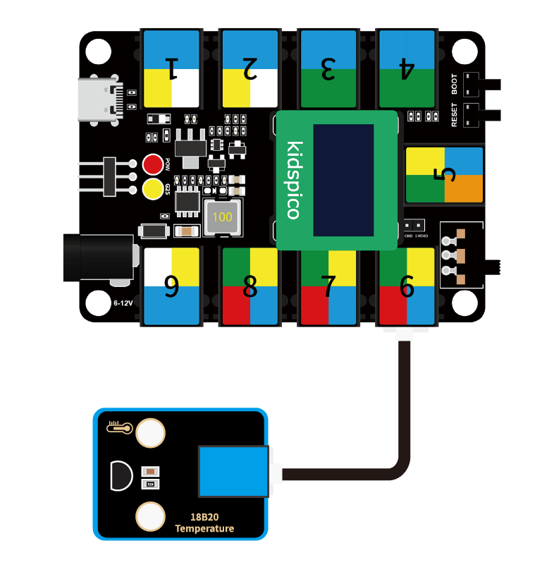

#### Test Code

Open **3.6Temperature.py**

Before uploading code, please import library to kidspico. Open **ds18x20.py** and **onewire.py** and choose *Upload to /*.


Click  to run code.

```python
'''
 * Filename    : Temperature
 * Thonny      : Thonny 4.1.4
 * Auther      : http//www.keyestudio.com
'''
import machine
import onewire
import ds18x20
import time
 
# Connect DS18B20 to IO22.
ds18b20_pin = machine.Pin(22)
ds18b20_sensor = ds18x20.DS18X20(onewire.OneWire(ds18b20_pin))
 
roms = ds18b20_sensor.scan()

while True:
    if roms:
        # Only process the first discovered DS18B20.
        rom = roms[0]
        res = ds18b20_sensor.convert_temp()
        
        # Wait for the conversion.
        time.sleep(0.1)
        
        temp = ds18b20_sensor.read_temp(rom)
        print(temp)
    else:
        print("No DS18B20 sensor found!")
```

#### Explanations


1. ```python
   import onewire
   import ds18x20
   ```

   import necessary micropython module.


2. `ds18b20_pin = machine.Pin(22)`

   set the IO pin connected to DS18B20 temperature sensor.


3. `roms = ds18b20_sensor.scan()`

   scan the connected DS18B20 temperature sensor.


4. `res = ds18b20_sensor.convert_temp()`

   Enable the temperature conversion via `convert_temp`.


5. `time.sleep(0.1)`

   Set a delay to ensure the completion of conversion.


6. `temp = ds18b20_sensor.read_temp(rom)`

   Read temperature value via `read_temp`.


7. ```python
   if roms:
       # Only process the first discovered DS18B20.
       rom = roms[0]
       res = ds18b20_sensor.convert_temp()
           
       # Wait for the conversion.
       time.sleep(0.1)
           
       temp = ds18b20_sensor.read_temp(rom)
       print(temp)
   else:
       print("No DS18B20 sensor found!")
   ```

   if: 
   
   Scan for DS18B20 temperature sensor and output the read temperature value. If no DS18B20 sensor is found, print *No DS18B20 sensor found!* .


#### Test Result


After uploading code, the Shell prints the temperature value detected by DS18B20 sensor.


Click  or Ctrl+C to exit the execution.


---

### 3.7 Ultrasonic Sensor


When bats fly, they produce ultrasonic waves from their throats, which are emitted from their mouths. When ultrasonic waves encounter an insect or obstacle, they are reflected back and then picked up by the bats' ears. Bats calculate the distance by the reflected wave and also determine whether the target is an insect or an obstacle. 

Therefore, scientists developed ultrasonic ranging. The ultrasonic sensors in this experiment are based on bionic science.


#### Parameters


Operating voltage: DC 5V 

Operating current: 15 mA 

Operating frequency: 40 KHz

Measuring angle: ≤ 15°C

Ultrasonic range: 2 cm ~ 400cm (peak)

Operating temperature: -10°C ~ +50°C

Output signal: analog signal

Dimensions of ultrasonic sensor: 20 x 45 x 12 mm (without pins)

Dimensions of ultrasonic sensor converter: 24 x 32 x 18 mm (without housing)

Positioning holes: diameter of 4.8 mm

Interface: telephone socket


#### Principle


After the ultrasonic sensor receives the trigger signal (the board sends a high level to the Trig pin), the module automatically sends eight 40KHZ square waves and starts timing. 

The ultrasonic wave propagates in the air and immediately reflects back when it encounters the obstacle surface on the way (the Echo pin sends a high level to the board). 

The ultrasonic receiver stops timing as soon as it receives the reflected waves. So then the module will record the interval between the initial transmission of the ultrasonic wave and the reception of the echo.

This is how the sensor calculate the distance from the obstacle.


**Working Principle:**

1. Trig pin enables the distance detection and transmits a high level signal for at least 10us.

2. Circularly send eight 40KHz square waves, and automatically detect whether there is a response signal.

3. If there is a response, Echo pin will output high lasting from ultrasonic wave transmitting to receiving.

   Calculation of the distance between the ultrasonic sensor and the obstacle:

   Distance = high level duration × 340m/s ÷ 2

   (The sound speed varies from the nature and state of the medium. In air, the sound speed is about 340m/s at 1 standard atmosphere and 15 °C)

Since the ultrasonic module pins cannot be directly connected to the board, a converter module is required to connect it to the port in yellow on the board.


In this experiment, we connect the module to port 7. According to the board ports view, Trig pin is connected to io21 and Echo is to io27.


#### Wiring Diagram


#### Test Code

Open **3.7Ultrasonic.py** and click .

```python
'''
 * Filename    : Ultrasonic
 * Thonny      : Thonny 4.1.4
 * Auther      : http//www.keyestudio.com
'''
from machine import Pin
import time

# Set ultrasonic sensor pins
Trig = Pin(21, Pin.OUT) 
Echo = Pin(27, Pin.IN)

distance = 0 # set initial distance value to 0
soundVelocity = 340 #Set the speed of sound.

# getDistance(): enable the ultrasonic sensor to detect distance
# Echo.value(): read the state of pin Echo of the ultrasonic sensor. 
# The timestamp function of the time module calculates the high-level duration of the Echo; it calculates the measured distance based on the duration and return the finnal value.
def getDistance():
    # miantain pin Trig at high level for 10us to enable the ultrasonic sensor
    Trig.value(1)
    time.sleep_us(10)
    Trig.value(0)
    # start counting: the initial time of ultrasonic wave transmitting in the air
    while Echo.value() == 0:
        Start = time.ticks_us()
    # receive the time of the reflection of the ultrasonic wave
    while Echo.value() == 1:
        Stop = time.ticks_us()
    # total time = the receiving time - the initial time
    Time = time.ticks_diff(Stop,Start)
    # Calculat the distance according to the formula: distance(m)
    # distance value devide by 100: distance(cm)
    distance =  Time * soundVelocity //2 // 10000
    # return the distance value in cm
    return distance

# print the value every 500ms
while True:    
    print('Distance: ', getDistance(), 'cm')
    time.sleep_ms(500)
```

#### Explanations


1. `def getDistance():`

   Create a function that drives the ultrasonic sensor to measure distance. Return the measured results.


2. `print("Distance: ", getDistance(), "cm")`

   Print the detected distance value.

   Commas separates the content that needs to be printed, and content in single quotes will be printed directly.


#### Test Result


After uploading code, the Shell prints the distance value between the ultrasonic sensor and the obstacle.


Click  or Ctrl+C to exit the execution.


---

### 3.8 Five-channel AD Button Module


When using, the five-channel AD button module only occupies one analog port, which greatly saves ports and pins. In analog acquisition, when we press different buttons, it outputs different voltages.


#### Parameters


Operating voltage: DC 3.3 ~ 5V 

Operating current: 2.5 mA

Operating power: 0.0125 W

Operating temperature: -10°C ~ +50°C

Output signal: analog signal

Dimensions: 24 x 48 x 18 mm (without housing)

Positioning holes: diameter of 4.8 mm

Interface: telephone socket


#### Principle


Due to the circuit design, the corresponding output voltage varies when we press different button. 

The voltage value is read by the board ADC and then compared with the pre-determined voltage range of each button, so that we can determine which button is pressed.


**What is ADC?**

ADC(Analog to Digital Converter) converts analog values to digital ones. The ADC acquisition is integrated in our board, so you can call it directly. 

**Kidspico ADC Parameters**

1. Reference voltage: 3.3V

1. Resolution: 12bit

   A n-bit ADC means this ADC contains 2ⁿ scales. 

   12-bit ADC contains $2^{12}=4096$ scales, and it outputs totally 4096 digital values (including from 0～ 4095), each scale is $\frac{3.3}{4095}≈0.00081(V)$.

2. General ADC input voltage calculation

   <font face="courier New" color="black" size=6>$Vin=\frac {AVDD_{ADC}}{2^{Resolution Bit}-1}*ReadData$</font> 

   $AVDD_{ADC}$: Reference voltage

3. ADC channel: 5 channels 

   ADC0 - ADC3 are GPIO26 - 29, among which ADC0, ADC1, ADC2 are available to commonly measure the analog voltage, while ADC3 detects on-board VSYS voltage.

   Since ADC4 is built-in, it cannot be used at the pin. It measures on-board temperature sensor.


Modules with red housing are analog ones, so we should connect to analog io pins of the mainboard (ports with red).

In this experiment, we connect the module to port 8. According to the board ports view, the analog io pin at port 8 is io26.


#### Wiring Diagram


#### Test Code

Open **3.8Five-way AD.py** and click .

```python
'''
 * Filename    : Five-way AD
 * Thonny      : Thonny 4.1.4
 * Auther      : http//www.keyestudio.com
'''
from machine import ADC
import time 

# enable and configure ADC, range 0-3.3V
key = ADC(26)

while True:
    key_value = key.read_u16()
    print(key_value, end = '')
    # key_value < 10000
    if key_value < 10000: 
        print('  no key  is pressed')
    # 10000 < key_value < 14000
    elif key_value < 14000:
        print('  SW5 is pressed')
    # 14000 < key_value < 27000
    elif key_value < 27000:
        print('  SW4 is pressed')
    # 27000 < key_value < 40000
    elif key_value < 40000:
        print('  SW3 is pressed')
    # 40000 < key_value < 53000
    elif key_value < 53000:
        print('  SW2 is pressed')
    # 53000 < key_value
    else:
        print('  SW1 is pressed')
    time.sleep(0.1)
```

#### Explanations


1. `from machine import ADC`

   Import ADC module.

   

   **machine.ADC function**

   - `machine.ADC(id)`	: ADC object constructor initializes the corresponding ADC channel.

     id: GPIO (PIN) object (GPIO26 ~ 29) or ADC channel (0 ~ 3)

   - `ADC.read_u16() `	: read corresponding ADC value and return the read value.

     ATTENTION: <span style="color: rgb(10, 10, 200);">In MicroPython, the ADC is converted to 16-bit for calculation, that is, from 0 to 65535. This function does not directly return the value read by ADC, but the processed one, which ranges from 0 to 65535.</span>


2. `key = ADC(26)`

   Define ADC0 to output the analog value of 5-channel AD button module.
   
   ADC0 - ADC3 are GPIO 26 - 29, among which ADC0, ADC1, ADC2 are available.


3. `key_value = key.read_u16()`

   Read the corresponding ADC0 value and assign it to key_value.
   
   We adopt  `read()` when reading the digital input, while  `read_u16()` is required when reading analog input.  `u16` is used as a remainder that you receive an unsigned 16-bit integer(between 0 and 65535), instead of a binary 0 or 1.


4. `print(key_value, end = '')`

   Print the module analog output value without wrapping.
   
   print() function will wrap to output values by default, so we need to add an `end=""` to remove the "wrap".
   
   
   
   Q : Why without wrapping?
   
   A : Print the analog value and the message in the same line, which is more convenient for results checking.
   
   In the same line:
   
   
   
   In the next line:
   
   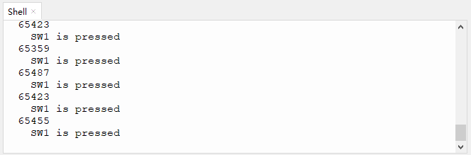
   
   


5. `print('  no key  is pressed')`

   Print two spaces + *no key  is pressed* on the Shell.

   

   Q : Why two spaces?

   A : The analog value is output without wrapping. If we remove the spaces, the messages will be printed just close to the analog values.

   Without space:

   

   With Spaces: 
   
   


#### Test Result


After uploading code, press the buttons and the Shell will print the corresponding analog value and messages.


Click  or Ctrl+C to exit the execution.


---

### 3.9 130 Motor	


130 motor does not require an additional driver board to enable itself. Also, you may adjust the rotation speed via PWM. Therefore, it is perfect to DIY small projects or crafts.

Please mount the fan on the motor first.


#### Parameters


Operating voltage: DC 3.3 ~ 5V 

Operating current: ≤ 200 mA (peak 350±20% mA)

Maximum power: ≤2 W

Rotation speed: 3.3V (2500±10% rpm); 5V (16000±10% rpm)

Operating temperature: -10°C ~ +50°C

Dimensions: 24 x 48 x 18 mm (without housing)

Positioning holes: diameter of 4.8 mm

Interface: telephone socket


#### Principle


This motor is a two-channel digital module, so during using, we need to connect to ports in blue or yellow on the board.

We add voltage to both ends of the motor to control its rotation. Within the limit, the greater the voltage is, the faster the rotation speed will be; similarly, the lower the voltage is, the slower the rotation speed will be, and it even can be slow enough till stopping. Besides, the rotation direction also depends on the voltage direction.

We control the rotation speed via PWM.

There is a certain relationship between PWM duty cycle and voltage. During the PWM cycle, when the duty cycle changes, the high level duration will also change. When the duty cycle is small, the high level duration is short, and the corresponding average voltage is relatively low. On the contrary, when the duty cycle is large, the high level duration will be longer, and the corresponding average voltage is relatively high. 

In simple terms, the (PWM) output voltage is directly proportional to its duty cycle. As the duty cycle increases, the output voltage increases accordingly, and vice versa.

Therefore, <span style="color: rgb(10, 10, 200);">we control the  output voltage through the PWM duty cycle, so then we control the speed of the motor via PWM.</span>


**What is PWM?**

PWM (Pulse width modulation) is a scheme that simulates the change of analog signals by digital signal.

Pulse width is the high level part in a complete square wave cycle. Therefore, PWM is a modulation of high level. Of course, in other words, the cycle is fixed, so it adjust the low level part as well. 


- **PWM frequency**

  Frequency is the number of times the signal goes from high to low level and back to high in 1 second (this is one cycle), that is, how many cycles there are in a second PWM.

  Unit: Hz

  Expression: 50Hz; 100Hz

- **PWM cycle**

  <font face="courier New" color="black" size=6>$ T = \frac {1}{f}$</font>

  <font face="courier New" color="black" size=6>$ Cycle = \frac {1}{Frequency}$</font>

  When frequency is 50Hz, i.e., the cycle is 20ms, there are 50 PWM cycles within 1s.

- **PWM duty cycle**

  Duty cycle is the ratio of the time of the high level to the that of the whole cycle in a cycle.

  Unit: % (1% ~ 100%)

  For example, when we set the duty cycle of an LED, the greater the duty cycle is, the brighter the LED will be.

  

- **Cycle**: The time of a pulse signal. Frequency is the number cycles in 1s.

- **Pulse width time**: high level time.

We have already known that Kidspico GPIO pins are able to output high(LED on) or low(LED off). Yet, **they can also output PWM**. The high and low level changes according to a certain frequency, so the frequency and duty cycle can be easily set and changed.


In this experiment, the motor we use is designed two control ports: INA and INB.

When the PWM of INA is greater than that of INB, the motor rotates counterclockwise. The greater the difference value is, the faster the speed will be.


When the PWM of INB is greater than that of INA, the motor rotates clockwise. The greater the difference value is, the faster the speed will be.

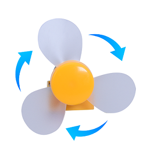

When both INA and INB are 0, the rotation stops.

In this experiment, we connect the module to port 9. According to the board ports view, we connect the motor INA pin to io14 and INB to io15.


#### Wiring Diagram


#### Test Code

Open **3.9Motor.py** and click .

```python
'''
 * Filename    : Motor
 * Thonny      : Thonny 4.1.4
 * Auther      : http//www.keyestudio.com
'''
from machine import Pin,PWM
import time
 
# set PWM INA and INB pins
pwm_INA = PWM(Pin(14)) 
pwm_INB = PWM(Pin(15)) 
 
# set PWM frequency. The frequency depends on the motor application.
pwm_INA.freq(500)
pwm_INB.freq(500)
 
# Set the maximum and minimum rotation speed
max_duty = 65535
min_duty = 0
 
# Linear interpolation is used to calculate duty values for different speeds
def calc_duty(speed):
    speed = int(speed * (max_duty - min_duty) / 100 + min_duty)
    return speed
 
# change the rotation speed
def set_speed_INA(speed):
    duty = calc_duty(speed)
    pwm_INA.duty_u16(duty)

# change the rotation speed
def set_speed_INB(speed):
    duty = calc_duty(speed)
    pwm_INB.duty_u16(duty)

while True:
    #speed 50, counterclockwise rotate for 2s
    set_speed_INA(50) #speed range: 0 ~ 100
    time.sleep(2)
    set_speed_INA(0)
    time.sleep(1)
    
    #speed 50, clockwise rotate for 2s
    set_speed_INB(50)
    time.sleep(2)
    set_speed_INB(0)
    time.sleep(1)
```

#### Explanations


1. `from machine import Pin,PWM`

   Import Pin and PWM function.

   
   
    **machine.PWM**
   
   - `machine.PWM(pin)` : PWM object constructor, it reinitializes the specified GPIO and sets to PWM output.
   
     pin : GPIO object that needs to be set to PWM output.
   
   - `PWM.freq（value）` : set PWM output frequency.
   
     value : PWM output frequency. The value should conform to the PWM frequency calculation formula.
   
   - `PWM.duty_u16（value）` : set duty cycle. The corresponding value is calculated automatically through value.
   
     value : set duty cycle ratio, within 0-65536.


2. `pwm_INA = PWM(Pin(14))`  `pwm_INB = PWM(Pin(15))`

   Set INA to pin io14, set INB to pin io15.


3. `pwm_INA.freq(500)`  `pwm_INB.freq(500)`

   Set PWM output frequency of INA to 500, set PWM output frequency of INB to 500.


4. ```python
   # Set the maximum and minimum
   max_duty = 65535
   min_duty = 0
    
   # Linear interpolation is used to calculate duty values for different speeds
   def calc_duty(speed):
       speed = int(speed * (max_duty - min_duty) / 100 + min_duty)
       return speed
    
   # change the rotation speed
   def set_speed_INA(speed):
       duty = calc_duty(speed)
       pwm_INA.duty_u16(duty)
   
   # change the rotation speed
   def set_speed_INB(speed):
       duty = calc_duty(speed)
       pwm_INB.duty_u16(duty)
   ```

   - ① kidspico PWM duty cycle ranges within 0 ~ 65535, so then the maximum and minimum speed of the motor can be set accordingly.

   - ② `def calc_duty(speed):`  Define a function to convert the speed value to duty cycle.

     Set speed range to 0 ~ 100, `(max_duty - min_duty) / 100` calculates the duty cycle of the minimum speed unit.

     **speed** is the set speed value, and when it multiplies by the duty cycle of the smallest speed unit, the duty cycle of speed can be calculated.

   - ③`def set_speed_INA(speed):` Define a function that sets the speed of the motor.

     `duty = calc_duty(speed)` : assign the duty cycle value of speed to **duty**.

     `pwm_INA.duty_u16(duty)` : set duty cycle. Set the value of **duty** to the duty cycle of INA. So we can control the rotation speed by setting values (0 ~ 100).


5. ```python
   while True:
       # speed 50, counterclockwise rotate for 2s
       set_speed_INA(50) # speed range: 0 ~ 100
       time.sleep(2)
       set_speed_INA(0)
       time.sleep(1)
       
       # speed 50, clockwise rotate for 2s
       set_speed_INB(50)
       time.sleep(2)
       set_speed_INB(0)
       time.sleep(1)
   ```

   - `set_speed_INA(50)` : set channel speed, within 0 ~ 100.
   - `time.sleep(2)` : delay, it is used to control the rotation time.

   

   Q : Why we set the speed value to 0 after setting it?

   After setting INA speed to 50, if we do not reset it to 0, it will maintain speed of 50. When the program runs to `set_speed_INB(50)` , INA will equals INB so then the motor stops working. 

   A  : We zero out the value to avoid that it may effect the following codes.

   


#### Test Result


<span style="color: rgb(2550, 10, 50);">**WARNING: Do not hold the fan with your hand before uploading the code. When using, please face the fan to an open place to avoid injury.**</span>

After uploading code, the fan rotates counterclockwise for 2s and then stops for 1s. Therewith, it rotates clockwise for 2s and then stops for 1. These actions will take place in a loop.

Press  or Ctrl+C to exit the execution.


---

### 3.10 IR Receiver


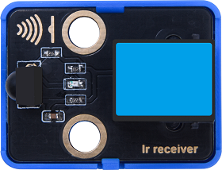

Infrared remote control is one of the most widely used means of communication and remote control. 

IR remote control devices features small size, low power consumption, multiple functions and low cost, so that it is integrated in various equipments, such as recorders, audio equipments and air conditioners.

Herein, the internal IC of this module has been tuned. The receiver outputs digital signals and can receive the standard 38KHz modulated remote control signals.


#### Parameters


Operating voltage: DC 3.3 ~ 5V

Operating current: 1.5 mA

Maximum power: 0.0075 W

Carrier frequency: 38 KHz

Wave length: 940 λp(nm)

Receiving distance: 6m at 45°; 14m in parallel.

Operating temperature: -10°C ~ +50°C

Dimensions: 24 x 48 x 33.4 mm (without housing)

Positioning holes: diameter of 4.8 mm

Interface: telephone socket


#### Principle


The transmitting circuit is composed of infrared light-emitting diode, which emits the modulated infrared light wave.

The receiving circuit includes an infrared receiving diode, a triode, or a silicon photocell, which receives the modulated infrared light waves emitted by the transmitter and then converts them into electrical signals. After that, these electrical signals are amplified, filtered and demodulated to restore the encoded instruction signals. The decoded signals can be read and recognized by the board as to perform corresponding operations.

Modules with blue housing are digital ones, so we should connect to digital io pins of the mainboard (ports with blue).

In this experiment, we connect the module to port 1. According to the board ports view, the digital io pin at port 1 is io11.


#### Wiring Diagram


#### Test Code

Open **3.10Infrared Receiver.py** and click .

```python
'''
 * Filename    : Infrared Receiver
 * Thonny      : Thonny 4.1.4
 * Auther      : http//www.keyestudio.com
'''
import utime
from machine import Pin

# set receiver pin to 11
ird = Pin(11,Pin.IN)

# Infrared code for each key
act = {"1": "LLLLLLLLHHHHHHHHLHHLHLLLHLLHLHHH","2": "LLLLLLLLHHHHHHHHHLLHHLLLLHHLLHHH","3": "LLLLLLLLHHHHHHHHHLHHLLLLLHLLHHHH",
       "4": "LLLLLLLLHHHHHHHHLLHHLLLLHHLLHHHH","5": "LLLLLLLLHHHHHHHHLLLHHLLLHHHLLHHH","6": "LLLLLLLLHHHHHHHHLHHHHLHLHLLLLHLH",
       "7": "LLLLLLLLHHHHHHHHLLLHLLLLHHHLHHHH","8": "LLLLLLLLHHHHHHHHLLHHHLLLHHLLLHHH","9": "LLLLLLLLHHHHHHHHLHLHHLHLHLHLLHLH",
       "0": "LLLLLLLLHHHHHHHHLHLLHLHLHLHHLHLH","Up": "LLLLLLLLHHHHHHHHLHHLLLHLHLLHHHLH","Down": "LLLLLLLLHHHHHHHHHLHLHLLLLHLHLHHH",
       "Left": "LLLLLLLLHHHHHHHHLLHLLLHLHHLHHHLH","Right": "LLLLLLLLHHHHHHHHHHLLLLHLLLHHHHLH","Ok": "LLLLLLLLHHHHHHHHLLLLLLHLHHHHHHLH",
       "*": "LLLLLLLLHHHHHHHHLHLLLLHLHLHHHHLH","#": "LLLLLLLLHHHHHHHHLHLHLLHLHLHLHHLH"}

# Read the infrared signal and decode it
def read_ircode(ird):
    wait = 1
    complete = 0
    seq0 = []
    seq1 = []

    while wait == 1:
        if ird.value() == 0:
            wait = 0
    while wait == 0 and complete == 0:
        start = utime.ticks_us()
        while ird.value() == 0:
            ms1 = utime.ticks_us()
        diff = utime.ticks_diff(ms1,start)
        seq0.append(diff)
        while ird.value() == 1 and complete == 0:
            ms2 = utime.ticks_us()
            diff = utime.ticks_diff(ms2,ms1)
            if diff > 10000:
                complete = 1
        seq1.append(diff)

    code = ""
    for val in seq1:
        if val < 2000:
            if val < 700:
                code += "L"
            else:
                code += "H"
    #print(code)  
    command = ""
    for k,v in act.items():
        if code == v: 
            command = k
    if command == "":
        command = code
    return command

while True:
    command = read_ircode(ird)
    print(command)
    utime.sleep(0.5)
```

#### Explanations


1. ```python
   act = {"1": "LLLLLLLLHHHHHHHHLHHLHLLLHLLHLHHH","2": "LLLLLLLLHHHHHHHHHLLHHLLLLHHLLHHH","3": "LLLLLLLLHHHHHHHHHLHHLLLLLHLLHHHH",
          "4": "LLLLLLLLHHHHHHHHLLHHLLLLHHLLHHHH","5": "LLLLLLLLHHHHHHHHLLLHHLLLHHHLLHHH","6": "LLLLLLLLHHHHHHHHLHHHHLHLHLLLLHLH",
          "7": "LLLLLLLLHHHHHHHHLLLHLLLLHHHLHHHH","8": "LLLLLLLLHHHHHHHHLLHHHLLLHHLLLHHH","9": "LLLLLLLLHHHHHHHHLHLHHLHLHLHLLHLH",
          "0": "LLLLLLLLHHHHHHHHLHLLHLHLHLHHLHLH","Up": "LLLLLLLLHHHHHHHHLHHLLLHLHLLHHHLH","Down": "LLLLLLLLHHHHHHHHHLHLHLLLLHLHLHHH",
          "Left": "LLLLLLLLHHHHHHHHLLHLLLHLHHLHHHLH","Right": "LLLLLLLLHHHHHHHHHHLLLLHLLLHHHHLH","Ok": "LLLLLLLLHHHHHHHHLLLLLLHLHHHHHHLH",
          "*": "LLLLLLLLHHHHHHHHLHLLLLHLHLHHHHLH","#": "LLLLLLLLHHHHHHHHLHLHLLHLHLHLHHLH"}
   ```
   
   The code of each key on the infrared remote control.


2. ```python
   def read_ircode(ird):
       wait = 1
       complete = 0
       seq0 = []
       seq1 = []
   
       while wait == 1:
           if ird.value() == 0:
               wait = 0
       while wait == 0 and complete == 0:
           start = utime.ticks_us()
           while ird.value() == 0:
               ms1 = utime.ticks_us()
           diff = utime.ticks_diff(ms1,start)
           seq0.append(diff)
           while ird.value() == 1 and complete == 0:
               ms2 = utime.ticks_us()
               diff = utime.ticks_diff(ms2,ms1)
               if diff > 10000:
                   complete = 1
           seq1.append(diff)
   
       code = ""
       for val in seq1:
           if val < 2000:
               if val < 700:
                   code += "L"
               else:
                   code += "H"
       #print(code)
       command = ""
       for k,v in act.items():
           if code == v:
               command = k
       if command == "":
           command = code
       return command
   ```

   Define a function that reads and decodes the infrared signals, and pairs the corresponding key name based on the decoding.


3. ```python
   while True:
       command = read_ircode(ird)
       print(command)
       utime.sleep(0.5)
   ```

   Print the name of the pressed keys on the infrared remote control.


#### Test Result


<span style="color: rgb(2550, 10, 50);">Before using the infrared remote control, please firstly remove the transparent insulation sheet at the bottom.</span>

After uploading code, align the remote control with the receiver and press any key on it. After receiving signals, the Shell prints the corresponding key value and meanwhile, the LED on the infrared receiver flashes.

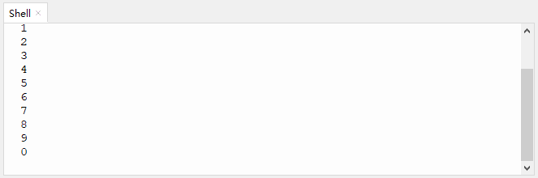

Click  or Ctrl+C to exit the execution.


---

## 4. Comprehension

### 4.1 Temperature Detection

The fan will monitor the operating temperature. When it is overheat, the fan will start to rotate automatically. 

This temperature detection device adopts a DS18B20 temperature sensor and an 130 motor.

#### Flow


#### Assembly


**Required Components**


**Step 1**


**Step 2**


**Step 3**


**Step 4**


**Step 5**


**Step 6**


**Step 7**

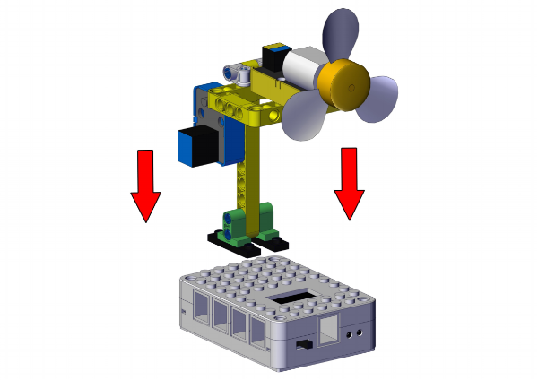


**Completed**


#### Wiring Diagram


#### Test Code

Open **4.1Temperature detection.py** and click .

```python
'''
 * Filename    : Temperature detection
 * Thonny      : Thonny 4.1.4
 * Auther      : http//www.keyestudio.com
'''
from machine import Pin
import machine
import onewire
import ds18x20
import time

# motor pins
INA = Pin(14, Pin.OUT) #INA corresponds to IN+
INB = Pin(15, Pin.OUT) #INB corresponds to IN- 

# connect DS18B20 to IO22
ds18b20_pin = machine.Pin(22)
ds18b20_sensor = ds18x20.DS18X20(onewire.OneWire(ds18b20_pin))
 
roms = ds18b20_sensor.scan()

temp = 0

while True:
    # delay 1s to wait for the stablization of DS18B20 sensor
    time.sleep(1)
    if roms:
        rom = roms[0]
        res = ds18b20_sensor.convert_temp()
        time.sleep(0.1)
        
        temp = ds18b20_sensor.read_temp(rom)
        print(temp)
    else:
        print("No DS18B20 sensor found!")
    if temp > 30:
        INA.value(0)
        INB.value(1)
    else:
        INA.value(0)
        INB.value(0)       
```

#### Explanations


**Conceive:**		

1. Initialization: set the pins of DS18B20 temperature sensor and 130 motor.

2. Loop:

   DS18B20 sensor reads the temperature value and outputs it.
   
   Determine whether the temperature value is greater than 30 (this threshold is adjustable according to needs).
   
   - temperature > 30: the fan rotates to cool down.
   - temperature <= 30: the fan does not work.


#### Test Result


NOTE: Please connect to a power supply externally to avoid uploading failure due to a power shortage.

After uploading code, the fan will rotate for cooling down when the temperature value exceeds 30°.

You can raise the temperature by pinching the DS18B20 sensor with your finger or lighting a lighter near the sensor. 

<span style="color: rgb(2550, 10, 50);">**WARNING: Please use lighters with the guidance of an adult!**</span>


---

### 4.2 Trigger Mode

We design to trigger the fan to automatically work when something approaches to it. This trigger mode integrates an ultrasonic sensor and an 130 motor.

#### Flow


#### Assembly


**Required Components**


**Step 1**


**Step 2**


**Step 3**


**Step 4**


**Step 5**


**Step 6**


**Step 7**


**Completed**


#### Wiring Diagram


#### Test Code

Open **4.2Trigger mode.py** and click .

```python
'''
 * Filename    : Trigger mode
 * Thonny      : Thonny 4.1.4
 * Auther      : http//www.keyestudio.com
'''
from machine import Pin
import time

Trig = Pin(21, Pin.OUT) 
Echo = Pin(27, Pin.IN)
INA = Pin(14, Pin.OUT) 
INB = Pin(15, Pin.OUT) 

distance = 0 # set initial distance to 0
soundVelocity = 340 #Set the speed of sound.

def getDistance():
    # maintain Trig pin at high level for 10us to enable the ultrasonic sensor
    Trig.value(1)
    time.sleep_us(10)
    Trig.value(0)
    #Start counting, record the initial time when ultrasonic waves starts to transmit
    while Echo.value() == 0:
        Start = time.ticks_us()
    #record the time when the ultrasonic echo is received
    while Echo.value() == 1:
        Stop = time.ticks_us()
    #total time = the receiving time - the initial time
    Time = time.ticks_diff(Stop,Start)
    # Calculat the distance according to the formula: distance(m)
    # distance value devide by 100: distance(cm)
    distance =  Time * soundVelocity //2 // 10000
    #return the distance value in cm
    return distance

while True:
    Distance = getDistance()
    print('Distance: ', Distance, 'cm')
    time.sleep_ms(500)
    if Distance < 10:
        INA.value(0)
        INB.value(1)
        time.sleep(1)
    else:
        INA.value(0)
        INB.value(0)
        time.sleep(1)
```

#### Explanations


**Conceive:**

1. Initialization: set pins of the ultrasonic sensor and the 130 motor.

2. Loop:

   ① Print the detected distance value every 500ms.

   ② Determine whether the value is less than 10 (this threshold is adjustable according to needs).

   - distance < 10: the fan starts to rotates.

   - distance >= 10: the fan does not work.


#### Test Result


After uploading code, get close to the ultrasonic sensor. When the ultrasonic sensor detects things around itself with a distance less than 10, the fan will rotates. If the distance equals or is greater than 10, the fan will stop rotating.


---

### 4.3 Remote Control Mode

In this project, we utilize an IR receiver and an 130 motor to construct a remote control fan, whose startup and rotation speed are controlled by a infrared remote control. 

#### Flow

 

#### Assembly


**Required Components**


**Step 1**


**Step 2**


**Step 3**


**Step 4**


**Step 5**


**Step 6**


**Completed**


#### Wiring Diagram


#### Test Code

Open **4.3Remote control.py** and click .

```python
'''
 * Filename    : Remote control
 * Thonny      : Thonny 4.1.4
 * Auther      : http//www.keyestudio.com
'''
from machine import Pin,PWM
import time
import utime

# set ir receiver pin to 11
ird = Pin(11,Pin.IN)

# set INA and INB to PWM pins
pwm_INA = PWM(Pin(14)) 
pwm_INB = PWM(Pin(15)) 
 
# set PWM frequency. The frequency depends on the motor application.
pwm_INA.freq(500)
pwm_INB.freq(500)
 
# Set the maximum and minimum rotation speed
max_duty = 65535
min_duty = 0
 
# Linear interpolation is used to calculate duty values for different speeds
def calc_duty(speed):
    speed = int(speed * (max_duty - min_duty) / 100 + min_duty)
    return speed
 
# change the rotation speed
def set_speed_INA(speed):
    duty = calc_duty(speed)
    pwm_INA.duty_u16(duty)

# change the rotation speed
def set_speed_INB(speed):
    duty = calc_duty(speed)
    pwm_INB.duty_u16(duty)

#set the inital key values of '1' '2' '3' on the remote control to 0    
key1_press_num = 0;
key2_press_num = 0;
key3_press_num = 0;

act = {"1": "LLLLLLLLHHHHHHHHLHHLHLLLHLLHLHHH","2": "LLLLLLLLHHHHHHHHHLLHHLLLLHHLLHHH","3": "LLLLLLLLHHHHHHHHHLHHLLLLLHLLHHHH",
       "4": "LLLLLLLLHHHHHHHHLLHHLLLLHHLLHHHH","5": "LLLLLLLLHHHHHHHHLLLHHLLLHHHLLHHH","6": "LLLLLLLLHHHHHHHHLHHHHLHLHLLLLHLH",
       "7": "LLLLLLLLHHHHHHHHLLLHLLLLHHHLHHHH","8": "LLLLLLLLHHHHHHHHLLHHHLLLHHLLLHHH","9": "LLLLLLLLHHHHHHHHLHLHHLHLHLHLLHLH",
       "0": "LLLLLLLLHHHHHHHHLHLLHLHLHLHHLHLH","Up": "LLLLLLLLHHHHHHHHLHHLLLHLHLLHHHLH","Down": "LLLLLLLLHHHHHHHHHLHLHLLLLHLHLHHH",
       "Left": "LLLLLLLLHHHHHHHHLLHLLLHLHHLHHHLH","Right": "LLLLLLLLHHHHHHHHHHLLLLHLLLHHHHLH","Ok": "LLLLLLLLHHHHHHHHLLLLLLHLHHHHHHLH",
       "*": "LLLLLLLLHHHHHHHHLHLLLLHLHLHHHHLH","#": "LLLLLLLLHHHHHHHHLHLHLLHLHLHLHHLH"}

# read the infrared signals and decode them
def read_ircode(ird):
    wait = 1
    complete = 0
    seq0 = []
    seq1 = []

    while wait == 1:
        if ird.value() == 0:
            wait = 0
    while wait == 0 and complete == 0:
        start = utime.ticks_us()
        while ird.value() == 0:
            ms1 = utime.ticks_us()
        diff = utime.ticks_diff(ms1,start)
        seq0.append(diff)
        while ird.value() == 1 and complete == 0:
            ms2 = utime.ticks_us()
            diff = utime.ticks_diff(ms2,ms1)
            if diff > 10000:
                complete = 1
        seq1.append(diff)

    code = ""
    for val in seq1:
        if val < 2000:
            if val < 700:
                code += "L"
            else:
                code += "H"
    #print(code)  
    command = ""
    for k,v in act.items():
        if code == v:
            command = k
    if command == "":
        command = code
    return command

while True:
    set_speed_INA(0) #INA zero out. In this experiment, we control the rotation speed only through INB
    command = read_ircode(ird)
    print(command, end = '')
       
    if command == '1':
        key1_press_num += 1
        key2_press_num = 0
        key3_press_num = 0
        if key1_press_num % 2 == 1:
            set_speed_INB(100)  # High speed
            print(' High speed')
        else:
            set_speed_INB(0)    # fan stops
            print(' off')
            
    elif command == '2':
        key2_press_num += 1
        key1_press_num = 0
        key3_press_num = 0
        if key2_press_num % 2 == 1:
            set_speed_INB(70)   # Medium speed
            print(' Medium speed')
        else:
            set_speed_INB(0)    # fan stops
            print(' off')
            
    elif command == '3':
        key3_press_num += 1
        key1_press_num = 0
        key2_press_num = 0
        if key3_press_num % 2 == 1:
            set_speed_INB(40)  # Low speed
            print(' Low speed')
        else:
            set_speed_INB(0)    # fan stops
            print(' off')
```

#### Explanations


1. ` if command == '1':`   if **command** equals the string **1**.

   Single quotes refer to string(s) rather than value(s).

   Rather than value(s), the **command** returns the corresponding string(s) on the infrared remote control after decoding and conversion. Therefore, single quotes are required to referring that it is not a value but a string. 

   In other words, this code means if key 1 on the remote control is pressed.


2.  

   | Operator | Description                               |
   | -------- | ----------------------------------------- |
   | %        | Modulo, return the remainder of division. |


3. ```python
   if command == '1':
       key1_press_num += 1
       key2_press_num = 0
       key3_press_num = 0
       if key1_press_num % 2 == 1:
           set_speed_INB(100)  # High speed
           print(' High speed')
       else:
           set_speed_INB(0)    # fan stops
           print(' off')
   ```

   If key 1 on the remote control is pressed, the value of `key1_press_num` adds 1, and `key2_press_num` and `key3_press_num` zero out.

   Calculation: `key1_press_num` is divided by 2 with a remainder of 1. So then the condition is met, and fan rotates at high speed.

   Press the key 1 again, and the value of `key1_press_num` will add 2, and the other two values zero out.

   Calculation: `key1_press_num` is divided by 2 with a remainder of 0. At this time, the condition is not satisfied, so the fan stops.

   Similarly, pressing key 2 and 3 can also perform these functions. Press for the first time and the fan rotates at corresponding speed; press again and the fan stops.


#### Test Result


After uploading code, we can control the startup and speed of the fan via the remote control.

Key 1: high speed

Key 2: medium speed

Key 3: low speed

These three speeds can have a switchover without stopping the fan. Press the same key again and the fan will stop.


---

### 4.4 Manual Control Mode

In this project, we adopt a capacitive touch sensor and an 130 motor to combine a fan in manual mode. We can control the startup of the fan by the capacitive touch sensor.

#### Flow


#### Assembly


**Required Components**


**Step 1**


**Step 2**


**Step 3**


**Step 4**


**Step 5**


**Step 6**


**Step 7**


**Completed**


#### Wiring Diagram


#### Test Code

Open **4.4Manual mode.py** and click .

```python
'''
 * Filename    : Manual mode
 * Thonny      : Thonny 4.1.4
 * Auther      : http//www.keyestudio.com
'''
from machine import Pin
import time

touch = Pin(2, Pin.IN)
INA = Pin(14, Pin.OUT)
INB = Pin(15, Pin.OUT)

press = 0

while True:
    if touch.value() == 1 and press == 0:
        INA.value(0)
        INB.value(1)
        press = 1
    elif touch.value() == 1 and press == 1:
        INA.value(0)
        INB.value(0)
        press = 0
    time.sleep(0.1)
```

#### Explanations


**Conceive:**

1. Initialization: 

	Set pins of the capacitive touch sensor and the 130 motor. 

	Define a variable press with an initial value of 0, which is used to control the state of motor.

2. Loop:

   ```python
   if touch.value() == 1 and press == 0: 
       INA.value(0)
       INB.value(1)
       press = 1
   ```
   
   When the module is touched (`touch.value() == 1`) and press = 0, the fan rotates and press will be assigned to value 1.
   
   ```python
   elif touch.value() == 1 and press == 1:
       INA.value(0)
       INB.value(0)
       press = 0
   ```
   
   When the module is touched (`touch.value() == 1`) and press = 1, the fan stops working and press will be assigned to value 0.
   
   Point: When we continuously touch the module, we need to know and control the state of the motor through the value of press.


#### Test Result


After uploading code, touch the module and the fan starts to work. Touch it again, and the fan will stop.


---

### 4.5 Variable Speed Mode

In this experiment, we build a small fan with variable rotation speed: 40%, 60%, 80% and 100%. The required modules are a five-channel AD button module (speed control) and an 130 motor. 

#### Flow

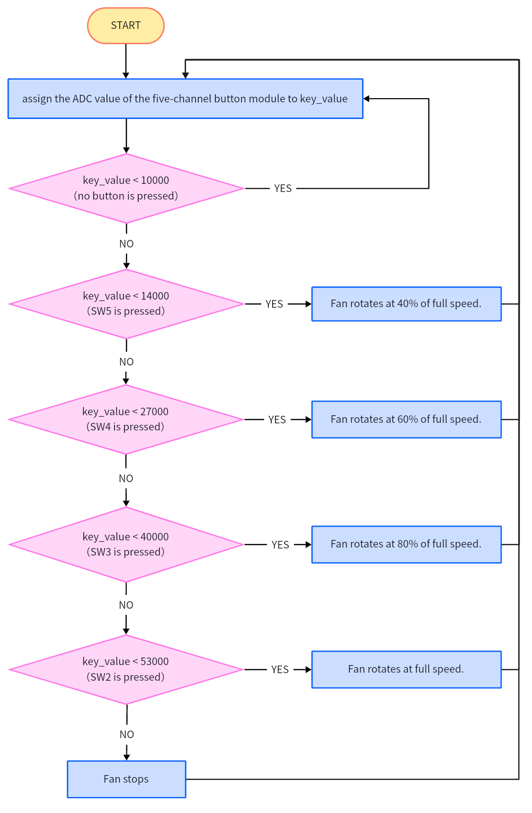

#### Assembly


**Required Components**


**Step 1**


**Step 2**


**Step 3**


**Step 4**

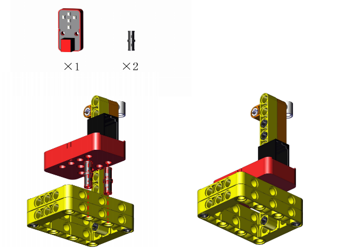


**Step 5**


**Step 6**


**Step 7**


**Completed**


#### Wiring Diagram


#### Test Code

Open **4.5Gearshift mode.py** and click .

```python
'''
 * Filename    : Gearshift mode
 * Thonny      : Thonny 4.1.4
 * Auther      : http//www.keyestudio.com
'''
from machine import Pin,PWM,ADC
import time

key = ADC(26)

# set INA and INB to PWM pins
pwm_INA = PWM(Pin(14)) 
pwm_INB = PWM(Pin(15)) 
 
# set PWM frequency. The frequency depends on the motor application.
pwm_INA.freq(500)
pwm_INB.freq(500)
 
# Set the maximum and minimum rotation speed
max_duty = 65535
min_duty = 0
 
# Linear interpolation is used to calculate duty values for different speeds
def calc_duty(speed):
    speed = int(speed * (max_duty - min_duty) / 100 + min_duty)
    return speed
 
# change the rotation speed
def set_speed_INA(speed):
    duty = calc_duty(speed)
    pwm_INA.duty_u16(duty)

# change the rotation speed
def set_speed_INB(speed):
    duty = calc_duty(speed)
    pwm_INB.duty_u16(duty)
    
while True:
    key_value = key.read_u16()

    if key_value < 10000:   # no key  is pressed
        pass

    elif key_value < 14000: # SW5 is pressed
        set_speed_INA(0)
        set_speed_INB(40)

    elif key_value < 27000: # SW4 is pressed
        set_speed_INA(0)
        set_speed_INB(60)

    elif key_value < 40000: # SW3 is pressed
        set_speed_INA(0)
        set_speed_INB(80)

    elif key_value < 53000: # SW2 is pressed
        set_speed_INA(0)
        set_speed_INB(100)

    else:                   # SW1 is pressed                 
        set_speed_INA(0)
        set_speed_INB(0)
    time.sleep(0.1)
```

#### Explanations


**Conceive:**

The code structure of program is similar to that of Chapter 3.8, so please refer to that section for detailed explanations.

1. Initialization: Set pins of AD button and 130 motor.

2. Loop:

   ① Press button 5 to adjust the speed to 40.

   ② Press button 4 to adjust the speed to 60.

   ③ Press button 3 to adjust the speed to 80.
   
   ④ Press button 2 to adjust the speed to 100.
   
   ⑤ Press button 1 to stop the fan.
   


#### Test Result


After uploading code, press button 5 - 2 orderly, and the fan speed will be adjusted to 40, 60, 80,100 accordingly. When you press button 1, the fan turns off.


---
