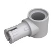
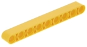

# Smart Fan Kit

## Description

Based on KidsBlock and python programming language, the Smart Fan Kit is designed for children aged 9-12 years old, which can be adapted to Legos and three types of mainboards: kidsUNO, kidsIOT and kidspico.

KidsBlock integrates building blocks to program by combining code blocks, so you do not have to learn complex programming syntax. You may learn programming much easier!

Python programming language is with simplicity and concise syntax, so it is easy to learn and suitable for beginners. You may master a systematic programming knowledge step by step!

In this kit, multiple sensors and modules are included: white LED module, RGB LED module, photo interrupter, capacitive touch sensor, TM1650 four-digit tube display, DS18B20 temperature sensor, ultrasonic sensor, five-channel AD button module, 130 motor and IR receiver. Besides, we design six modes for the kit with building blocks: temperature detection, trigger mode, remote control, manual control and variable speed mode. These building blocks are provided, so you may design forms at will, which greatly improves logical analysis, creativity, hands-on skills and problem-solving ability.

---

## Kit List

**The main boards are not included in this kit!**

|  #   |              NAME              |                     PIC                     | QTY  |
| :--: | :----------------------------: | :-----------------------------------------: | :--: |
|  1   |        White LED Module        |                  |  1   |
|  2   | RGB LED Module (Common Anode)  |                  |  1   |
|  3   |       Photo Interrupter        |                  |  1   |
|  4   |    Capacitive Touch Sensor     |                  |  1   |
|  5   | TM1650 Four-digit Tube Display |                  |  1   |
|  6   |   DS18B20 Temperature Sensor   |                  |  1   |
|  7   |       Ultrasonic Sensor        |                  |  1   |
|  8   |      Ultrasonic Converter      |                  |  1   |
|  9   |   5-channel AD Button Module   |                  |  1   |
|  10  |           130 Motor            |                  |  1   |
|  11  |              Fan               |              |  1   |
|  12  |          IR Receiver           |                  |  1   |
|  13  |        Telephone Cable         |                      |  5   |
|  14  |         Building Block         |                     |  15  |
|  15  |         Building Block         |                     |  2   |
|  16  |         Building Block         |                     |  3   |
|  17  |         Building Block         |                     |  2   |
|  18  |         Building Block         |                    |  2   |
|  19  |         Building Block         |                     |  2   |
|  20  |         Building Block         |                  |  2   |
|  21  |         Building Block         |                     |  1   |
|  22  |         Building Block         |                     |  1   |
|  23  |         Building Block         |      |  1   |
|  24  |         Building Block         |                     |  2   |
|  25  |         Building Block         |                     |  3   |
|  26  |         Building Block         |                     |  2   |
|  27  |         Remote Control         |  |  1   |

---

## Main Boards

**The main boards are not included in this kit!**

**Before experiments, please have a good grasp of main boards:**

[kidsuno](https://wiki.kidsbits.cc/projects/KD2075/en/latest/)

[kidsIOT](https://wiki.kidsbits.cc/projects/KD2076/en/latest/)

[kidspico]( https://wiki.kidsbits.cc/projects/KD2077/en/latest/)

**On-board OLED Display Tutorials:**

[kidsuno_OLED](https://wiki.kidsbits.cc/projects/KD2075/en/latest/docs/kidsUno.html#oled-display)

[kidsIOT_OLED](https://wiki.kidsbits.cc/projects/KD2076/en/latest/docs/kidsIOT.html#id1)

[kidspico_OLED](https://wiki.kidsbits.cc/projects/KD2077/en/latest/docs/KidsPico.html#id2)
